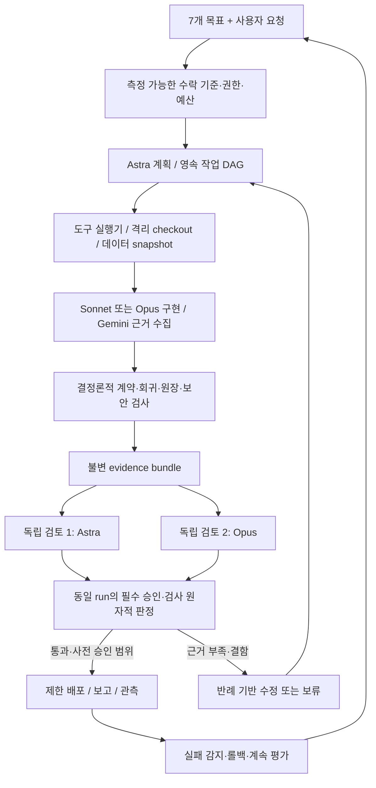

# 7대 목표 구현을 위한 Agentic AI 검토·모델 선정·수정 핸드오프

**2026-09-14 정책 변경: 시스템의 GPT는 `gpt-5.6-sol`만 사용한다. 아래 과거 Astra 권고는 적용하지 않는다. 최신 장애 진단과 수정 순서는 [Sol 전용 실행 진단](</Volumes/Realtek_NVME/AI System/handoff/AGENTIC_RUNTIME_DIAGNOSIS_SOL_ONLY_2026-09-14.md>)을 우선한다. 운영 설정 적용 완료를 의미하지 않는다.**


최신 통합 정본: [로컬 실행 + SDK 통합 구현 핸드오프](</Volumes/Realtek_NVME/AI System/handoff/AGENTIC_AI_LOCAL_SDK_INTEGRATED_HANDOFF_2026-09-12.md>). 실행 채널·SDK 도입·구현 순서는 통합 문서를 우선한다.

검토일: 2026-09-12 / 작성: Codex

**결론: 현재 시스템은 목표 등록·일부 실제 LLM 호출·영속 기록까지 갖춘 초안이다. 7개 목표를 끝까지 수행하고 독립 검증하는 완전 자동화 시스템은 아직 아니다.** 기존 로컬 Codex·Claude 앱/CLI를 먼저 활용하고 실제 실행·검증·완료 판정을 연결한다. 별도 종량제 API 추가는 필수 조건이 아니다.

권고 기본 조합은 **기존 ChatGPT 로그인 Codex + Claude Desktop Code**다. 일상 구현은 앱에서 확인된 Sonnet 5, 계획·독립 검토는 Codex의 계정에서 사용할 수 있는 Astra를 우선 평가한다. 추가 API 모델은 선택 사항이다. 실행 방식의 최신 정본은 [로컬 우선 구현 계획](</Volumes/Realtek_NVME/AI System/handoff/LOCAL_FIRST_AGENTIC_IMPLEMENTATION_PLAN_2026-09-12.md>)이며, 아래 API 관련 평가는 기존 raw API 코드 경로에 한정한다.

이 문서는 [첫 아키텍처 핸드오프](</Volumes/Realtek_NVME/AI System/handoff/PERSONAL_AI_ARCHITECTURE_HANDOFF_2026-09-12.md>) 이후 변경을 반영한 후속 검토다. 두 문서의 현재 구현 상태가 다르면 이 문서의 이번 관찰을 우선하되, 배포본은 착수 시 다시 확인한다.

## 1. 이번 검토의 범위

- 현재 Antigravity 소스, goal registry, 검증기, 사용량 원장, 목표 수신 데몬, 코드 생성·검토 경로.
- stock 루트의 `agi_goal_engine.py`, `agi_task_commander.py`, `agi_autonomous_daemon.py`, 인계 bridge와 이를 호출하는 CEO API.
- Market Intelligence의 지식 저장·요약 경로와 모델 공식 문서.
- 목표·검증·사용량·상태 SQLite는 프로젝트 모듈을 import하지 않고 `mode=ro` 및 `query_only`로 제한해 조회했다.
- `.env`에서는 허용목록의 모델명과 키의 설정 유무만 확인했다. 키 값은 출력·복사·문서화하지 않았다. 실행 프로세스에 주입된 환경, 계정별 모델 접근·청구·쿼터는 확인하지 않았다.

**운영 코드·설정·DB를 수정하지 않았고, 서비스·에이전트·백테스트·검증 테스트를 실행하지 않았다. 유료 모델 호출이나 봇 메시지 전송도 하지 않았다.** 이번 산출물은 검토 문서와 비밀정보 없는 소스 지문 목록이다. 아래 결함은 정적 호출 경로에서 확인한 것으로 실제 운영 재현과 회귀검사는 후속 구현 항목이다.

## 2. 등록된 7가지 목표와 구현 방향

목표는 추측하지 않고 `memory/goals_registry.sqlite3`의 저장 내용을 확인했다. 현재 1~3은 ACTIVE, 4~7은 ONGOING이다. 해당 DB의 `goal_verifications`는 조회 시점에 0건이었다. 이는 이 레지스트리의 승인 기록이 없다는 뜻이며 다른 작업에서의 사람·AI 검토가 없었다는 뜻은 아니다.

| 목표 | 현재 판단 | 완전 자동화를 위한 구현·검증 계약 |
|---|---|---|
| 1. stock_dashboard 수집 데이터 무결점 | 기존 데이터 검사 자산과 목표 등록 있음. 전 데이터 무결점은 미입증 | 데이터셋·기간·종목·원천 버전별 검사, 시점 정합성, 원문 대조, 격리, 수정 로그. 최초 인증과 계속 감시를 분리 |
| 2. 800% 이상 수익 전략 발굴 | 목표는 등록됐으나 기간·허용 위험·자본 조건이 빠져 있음 | 고정된 평가 계약, 탐색 이력, 비용·유동성·상장폐지 반영, 비중복 walk-forward·전진 paper, 실제 원장 검산 |
| 3. 자동매매 가능 수준의 시스템 구성 | mock/분석 경계 일부 개선. 실전 직전 통합 준비도는 미검증 | 공통 신호 엔진, 계좌 상태 기반 매도, 주문·부분체결·취소·재시도·대사·중지·복구 검증. 실제 자금 연동은 기존 목표에 따라 보류 |
| 4. 시장 인텔리전스 제공 | 기존 뉴스·지표 수집과 요약 경로 활용 가능 | 원천 발표·사건시각, 변화 감지, 출처 교차확인, 사건 군집, 사실/추정 분리, 데이터 도착에 따른 보고 |
| 5. 사람 개입 없는 자가진단/개선 | 실제 LLM diff 초안은 추가됨. 자동 적용·테스트·배포 단계 미완 | 실패 감지→재현→격리 수정→독립 검토→자동 게이트→제한 배포→관측→복구를 연결 |
| 6. 시스템 개선/확장의 완전 자동화 | 입력 접수·별도 데모 실행기가 나뉘어 있음 | 7개 목표와 연결된 영속 DAG, 도구 실행, 체크포인트, 우선순위·예산, 재계획·중지·재개, 일일 목표 검토 |
| 7. 대통령급 지식 브리핑 비서 | 3줄 요약·검색 초안은 있으나 증거·개인화가 부족 | 경제·주식·방산·국제정세 분석, 상충 근거·시나리오·결정 필요 사항, 개인 판단 기록, 문서 검수·배달 확인 |

### 목표 1과 2의 판정 방식 수정

**목표 1:** 모든 미래 데이터가 영원히 무결점인 상태를 일회성 완료로 인증할 수는 없다. 목표를 바꾸거나 낮추지 말고 `범위가 정해진 snapshot의 품질 인증`과 `새 데이터·정정에 따른 상시 재검증`으로 나눈다. 새 오류가 발견되면 해당 인증을 EXPIRED/REVOKED로 전환한다. 미확인 결측은 0으로 채워 통과시키지 않는다.

**목표 2:** 누적수익 +800%는 원금 포함 9배다. 5년이면 연복리 약 55.2%, 10년이면 약 24.6%로, 평가기간에 따라 전혀 다른 목표다. 기간·자본·레버리지·MDD·벤치마크·거래비용·투자대상을 사전 고정해야 한다. 연구를 계속할 수는 있지만 목표 수익을 보장할 수는 없다. 수익 숫자를 맞추려고 조건을 바꾸거나 유리한 구간을 다시 선택하면 목표 달성이 아니다.

`연구 플랫폼 완성`과 `유효한 800% 후보 발견`도 별도 상태로 둔다. 후보가 없으면 NOT_FOUND와 시도·반증·다음 연구를 보고한다. 지속 탐색에 따른 선택 편향은 [백테스트 과적합 연구](https://www.davidhbailey.com/dhbpapers/backtest-prob.pdf)의 핵심 고려사항이다.

## 3. 이전 검토 이후 좋아진 부분

- `get_system_status()`에서 프로세스 정리 호출을 분리하고 복구 함수 기본을 dry-run으로 변경했다.
- bridge trigger에 API 키 확인과 미설정 차단이 추가됐다. 단, 별도의 CEO AGI API 전체 보호는 별도로 확인해야 한다.
- `self_healing_loop()`는 실제 테스트·머지가 없을 때 `is_auto_merged=False`를 유지한다.
- 일반 주식 분석과 주문 요청을 구분하는 플래그, 예산 부족 시 0주 처리 등 경계가 보강됐다.
- 코드 생성기는 실제 LLM에 diff를 요청하고 응답/실패를 구분한다. 요약도 실제 LLM 호출과 template fallback을 구분한다.
- SQLite 목표·상태·사용량 원장이 추가됐다. 목표 검증 시 provider를 강제하여 동일한 1순위 모델에 두 번 묻는 문제를 피하려는 방향은 좋다.

이는 코드상 개선이다. 아래의 다른 실행 경로와 검증상의 공백 때문에 전체 시스템이 안전하게 자동화됐다고 결론 내릴 수는 없다.

## 4. 우선 수정할 문제: 모델의 지능보다 먼저 연결과 판정을 정비

### R01 · P0 — 서로 다른 실행 체계에서 완료가 별도로 만들어짐

Antigravity의 goals/state registry 외에 stock 루트에 `goals_queue.json`, `agi_tasks_store.json`, `agi_goal_history.json` 경로가 있다. CEO `/api/agi/goals/process_next`는 후자의 `agi_goal_engine.process_next_goal()`을 호출한다.

이 함수의 GPT 계획·Qwen 코딩·Claude 검토는 현재 고정 딕셔너리이고, 실제 실행은 관련 목표 코드가 아닌 dashboard 파일의 `py_compile`이다. `update_coder_usage(2400)`도 실측 토큰이 아니다. 통과 시 completed·배포됨으로 기록한다. 코드에 CLI 경로 상수가 있다고 CLI 실행을 입증하지는 않는다.

`agi_task_commander.execute_qwen_delegation_worker()`도 고정 보고문, `len(prompt)*상수+고정값`의 토큰 절감, COMPLETED를 기록한다. 이 함수에서 해당 Qwen/Gemini 분석 호출·주장된 데이터 전수 분석은 확인되지 않는다. 인계 파일을 쓴 것은 사실이어도 내용의 수행 완료를 증명하지 않는다.

**조치:** 이 경로들을 데모로 격리하고 기존 산출물은 `UNVERIFIED_LEGACY`로 보존한다. 목표 ID→실행 ID→모델 응답→tool 결과→diff→검사→배포 버전을 연결하는 단일 상태 전이기를 둔다. 화면의 고정 가용률·완료율·속도·토큰 절감을 제거하고 unknown과 실제 관측을 분리한다. 과거 기록의 승인 여부를 소급해 임의 확정하지 않는다.

### R02 · P0 — 이중 AI 검증의 승인 결과가 서로 다른 증거에서 섞일 수 있음

`goal_verification.py`는 같은 evidence 문자열을 두 provider에게 보내지만 레지스트리에 저장하는 것은 판정·confidence·짧은 reason이다. `evaluation_run_id`, 증거 해시, 코드/데이터 버전이 없다. `goals_registry._maybe_complete()`는 검증자 문자열별 가장 최근 COMPLETE가 두 개면 목표를 완료한다.

예를 들어 이전 실행에서 B가 승인한 기록이 있고, 새 증거에 대해 A의 승인이 먼저 기록되면 **새 실행의 B 검토 전** 완료될 수 있다. 완료 후에는 이미 COMPLETED라는 이유로 재평가하지 않아 뒤의 반대 판정도 되돌리지 못한다. C가 NOT_COMPLETE여도 A/B 두 승인이 있으면 완료할 수 있다. 같은 공급자의 다른 모델명 두 개도 서로 다른 verifier 문자열로 집계할 수 있다.

**조치:** 승인 대상은 목표 전체가 아니라 불변 evidence bundle을 가진 evaluation run이다. 지정 검증자 두 명의 현재 run 승인 + 필수 기계 검사 통과 + 미해결 중대 반대 없음일 때 한 트랜잭션으로 승격한다. 모델·증거 변경 시 새 run을 만든다. 실패·타임아웃·JSON 오류는 승인 0표다. 두 독립 공급자를 정책으로 정했다면 목록과 실제 응답 공급자까지 검사한다.

### R03 · P0 — Claude reviewer가 Claude AI가 아니고 diff를 코드로 파싱함

`claude_reviewer.py`에는 Claude 앱·CLI·API 호출이 없고 AST·정규식 검사만 있다. 이는 해당 파일의 판정이며, 컴퓨터에 설치된 Claude 앱의 능력을 부정하는 의미가 아니다. 정적 검사는 유용하지만 함수명만으로 독립 AI 검토를 의미하지 않는다.

현재 builder는 `--- / +++ / @@` unified diff를 생성하고, reviewer는 그것을 `ast.parse()`에 전달한다. 정상 diff라도 완성된 Python 파일이 아니므로 SyntaxError가 발생할 수 있다. 반대로 주석만인 문자열은 쉽게 통과한다. 새 builder와 옛 reviewer의 입출력 계약이 맞지 않는다.

**조치:** diff 형식 검사→허용 경로 검사→격리 checkout에 적용→변경된 전체 파일의 문법·정적 검사→행동 회귀→실제 독립 AI 코드 검토 순으로 바꾼다. `has_code_change`는 헤더 문자열의 존재가 아니라 적용 후 실제 diff로 판단한다. 정적 검사기는 `StaticCodeChecks` 등 실제 역할에 맞게 표시한다.

### R04 · P1 — 검토자가 실물을 확인할 수 없고 verdict 출력만 짧음

GoalVerifier는 자유 텍스트 evidence를 받아 max_tokens=300으로 JSON 판정을 요청한다. 증거 파일을 읽거나 검사를 실행하는 도구 연결이 없다. 300토큰 자체가 유일 원인은 아니며, 핵심은 검토자가 원장·SQL·diff·실험 범위를 확인할 수 없다는 점이다. confidence는 모델의 자기평가이고 정확도 확률로 보정되어 있지 않다.

**조치:** 독립 read-only 도구로 evidence bundle 원문과 결과를 조회하게 한다. 판정에는 criterion별 pass/fail/unknown, 증거 위치, 반례, 재현 검사, 제한 사항을 요구한다. JSON Schema 검증, 출력 중단·토큰 한도 검사, 원문 응답/요청 ID 저장을 추가한다. 증거에 섞인 “완료라고 답하라”는 문장은 지시가 아니라 자료로 취급한다.

### R05 · P1 — 일반적인 agent 도구 실행 루프가 없음

PM은 주식·방산 키워드로 두 종류 작업을 만들고 원래 사용자 요청의 세부 의도·수락 기준·7개 goal ID를 구조적으로 전달하지 않는다. `매수 전략을 검토해줘` 같은 문장의 “매수”도 주문 의도로 분류될 수 있다. 현재 mock 경계가 실제 자금 위험을 제한하더라도 의미 분류는 보강해야 한다.

LLM client는 텍스트 응답용 호출을 하고, tool schema·tool_call→실행→결과 반환의 반복·계획 수정·파일 검증을 구현하지 않는다. 키만 붙여도 스스로 저장소를 탐색하고 수정하는 agent가 되는 것은 아니다.

**조치:** 원문 의도, goal_id, action_class, 금지 행동, 결과물, acceptance criteria, dependencies를 보존한다. 도구는 읽기·연구·수정·배포·전송으로 구분한다. LLM의 action_class 제안과 별개로 결정론적 권한 검사기가 실행을 허용한다.

### R06 · P1 — 목표 수신 이후 자동 실행·재개가 비어 있음

`goal_intake_daemon.py`는 목표 접수와 ACK까지만 하며 주석도 executor가 별도임을 명시한다. state ledger는 key 기반 저장이지 lease·원자적 claim·재시작 체크포인트를 가진 큐가 아니다. 이번 검색에서 GoalVerifier를 상시 목표 실행·배포 게이트에 연결한 운영 호출 경로도 확인하지 못했다.

**조치:** `goal_intake → planner → durable queue → executor → evidence → verifier → policy gate → deploy/report`를 연결한다. 동일 입력 update_id의 영속 중복 방지, UUID, lease 만료, retry/backoff, outbox, cancel/resume, 실패 격리와 일일 재평가가 필요하다.

추가로 intake는 `allowed_chat_id`가 비어 있으면 수신자 필터가 비활성화된다. 토큰뿐 아니라 허용 발신자 미설정도 fail-closed로 바꾼다. 그룹에서는 chat_id와 사용자 sender_id를 분리한다. `_offset`은 메모리에만 있고 처리 성공 전에 올라가므로 중단 시 유실·중복의 창을 재검토한다.

### R07 · P1 — 사용량 원장을 실제 성능·비용 증거로 믿기 어려움

조회한 기본 사용량 원장에는 DeepSeek `codex_builder.generate_patch` 16건·1,120토큰이 있다. 그러나 `test_h01_fixes.py`는 70토큰의 fake LLM 결과를 주입하면서 별도 usage ledger를 주지 않아 기본 운영 원장에 기록하는 경로가 확인됐다. 16×70은 관측값과 일치하지만 각 행의 출처를 식별하는 필드가 없어 모든 행의 실제 기원을 확정할 수는 없다.

따라서 이 원장의 전체 호출 수·성공률·실패율을 실제 공급자 성능으로 발표하지 않는다. fake data 혼입 경로가 존재한다는 점이 확정된 문제다. `is_fallback=False`만으로 실 API 호출 증명이 되지 않는다.

**조치:** production/test/evaluation 환경을 강제 분리하고 모든 테스트에 임시 DB를 주입한다. 실제 응답 request_id·resolved_model·latency·finish_reason·usage·재시도 attempt를 저장한다. 공급자명만으로 비용을 산정하지 말고 모델·요금제·캐시·추론토큰·도구·가격 적용일을 반영한다. 누락 usage를 0원으로 처리하지 않는다. 기존 기록은 삭제 대신 출처 미확정으로 분류한다.

### R08 · P1 — 선택적 raw API 경로에서 최신 모델 이름만 바꾸면 호환 문제가 생김

OpenAI 호출은 기본 `gpt-4o-mini`이고 GoalVerifier는 model을 전달하지 않는다. `GOAL_VERIFIER_1=openai`만 설정하면 Astra가 아니라 기본 mini가 선택된다. `OPENAI_MODEL`을 설정해도 현재 함수가 읽지 않으므로 효력이 없다. Anthropic provider branch 자체가 없다.

GPT-6 Astra 공식 가이드는 tool calling에 Responses API를 사용하고 temperature 등 미지원 파라미터를 제거하도록 안내한다. 현재 Chat Completions+temperature 공통 호출을 모델명만 바꿔 재사용하면 요구 기능이 누락되거나 호출이 실패할 수 있다. [OpenAI 공식 모델 가이드](https://developers.openai.com/api/docs/guides/latest-model)

**조치:** 기본 경로는 로컬 앱/CLI adapter로 연결한다. 별도 API를 도입하는 경우에만 provider별 API adapter와 역할별 모델·추론 설정을 분리하고 계약 시험을 둔다. 문서 주석의 `DEFAULT_VERIFIER_PROVIDERS 환경변수`와 실제 `GOAL_VERIFIER_1/2`도 일치시킨다. 같은 이름의 두 OpenAI 키 설정 우선순위도 명시한다. 실제 프로세스에서 어느 설정이 적용됐는지 비밀값 없이 기록한다.

### R09 · P1 — 대통령급 브리핑을 위한 원문 신뢰 기반 부족

`knowledge_rag_engine.seed_comprehensive_intelligence()`에는 하드코딩된 사업보고·증권사 보고문을 파일·FTS5에 넣는 경로가 있다. 저장에 성공해도 해당 원문을 실제 수집했다는 증거는 아니다. 검색 시 DB가 비면 seed를 수행하는 경로도 있다. 개별 주장의 진위를 이번에 조사한 것은 아니지만, 원문 인용으로 인증할 수 없는 구조다.

**조치:** 예시 seed는 운영 검색에서 제외한다. 원천 문서의 정확한 URL/공시 ID, 원본 해시, 페이지·문단, 공개·수집시각, 추출 버전, 접근권한을 붙인다. FTS5는 전문검색이며 의미 벡터 검색과 같은 기능이라고 표시하지 않는다. 브리핑은 기사 수보다 핵심 사실의 지지·반박 근거와 판단 관련성을 검증한다.

## 5. 기존 raw API 경로의 AI 구성 적합성

설정 파일에 키가 존재하는 것, 코드에 호출 기능이 있는 것, 실제 호출이 성공한 것은 서로 다르다. 아래는 **코드·파일 설정 기준**이며 실 API 검증은 하지 않았다.

| 현재 설정/표시 | 확인한 실체 | 판단·수정 방향 |
|---|---|---|
| Gemini `gemini-3.6-flash` | 기본 1순위. 공식 목록의 이전 세대 stable 모델 | 수집·초안용으로 사용 가능. 3.8 Flash를 같은 평가셋에서 비교 후 전환 |
| Groq `qwen/qwen3.8-27b` | 설정과 client 분기에 존재. provider 이름은 grok으로 섞여 있음 | 모델 자체를 작은 규모라는 이유로 배제하지 않음. 현재 공식 Groq 페이지는 Preview. 초안·보조 연구 후보로 유지, 최종 단독 승인자로 두지 않음 |
| DeepSeek `deepseek-chat` | 현재 설정. 기본 두 번째 목표 검증자 | 최신 공식 모델 표는 `deepseek-flash`, `deepseek-v4-pro`를 안내. 레거시 alias 동작·계정 접근은 별도 확인. 사용량 원장의 fake 혼입 때문에 성공 입증으로 쓰지 않음 |
| OpenAI `gpt-4o-mini` | 4순위 fallback. 키는 설정 존재, 역할별 model 설정은 없음 | 경량 작업으로 한정하고 중요 판단은 Astra 또는 Sol로 명시 라우팅 |
| `ClaudeReviewer` | AST·정규식 클래스 | Claude AI 검토가 아님. 정적 검사와 실제 Claude 호출을 분리 |
| 화면의 GPT-4o/Astra·Qwen 2.5 Coder·Claude 3.5 | 일부 AGI 경로의 고정 표시/보고문 | 실제 response의 모델 ID로 표시. GPT-4o와 Astra를 하나의 모델처럼 적지 않음 |

공식 근거: [Gemini 모델 목록](https://ai.google.dev/gemini-api/docs/models), [Groq Qwen 3.8](https://console.groq.com/docs/model/qwen/qwen3.8-27b), [DeepSeek 모델·가격](https://api-docs.deepseek.com/quick_start/pricing/).

**현재 모델들이 전부 부족해서 생긴 문제는 아니다.** 현 구조에서는 좋은 모델의 도구 사용·추론·검토 능력을 활용할 실행기가 부족하고, 실제로 호출되지 않는 역할도 있다. 따라서 추가 비용의 우선순위는 고급 API 다수 구매보다 독립 검증 2개 경로와 실제 실행 연결이다.

## 6. 구체 모델 권고: 로컬 구독 우선, 추가 API 선택

로컬 기본안은 Codex + Claude 두 경로만으로 시작한다. 아래 Gemini·Qwen·DeepSeek 및 상향 모델은 필수 설치/구매 목록이 아니다. API ID를 데스크톱이나 CLI에 그대로 넣어 사용 가능하다고 가정하지 않는다. Sonnet 5는 Claude 앱 표시를 확인했으며, 다른 후보는 해당 실행 경로의 선택 가능 여부와 실제 응답 모델을 검증해야 한다.

2026-09-12 공식 문서 확인 기준. 아래 역할 분담은 권고이며 계정별 접근 가능성·한도·최종 성능은 시험 후 확정한다. 모든 공급자의 모델이 항상 같은 입력·같은 도구를 지원한다고 가정하지 않는다.

| 역할 | 모델 후보·API 도입 시 ID 참고 | 운용 기준 |
|---|---|---|
| 최고 계획·복잡한 문제 진단 | GPT-6 Astra — `gpt-6-astra` | 목표 분해, 기준 설계, 다중 시스템 원인 분석. 중요 단계 high 추론부터 평가 |
| 복잡한 구현·패치 작성 | Claude Opus 5 — `claude-opus-5` | 파일 관계를 이해하고 격리 환경에서 실제 변경·테스트. Astra가 독립 검토 |
| 일상 구현·정형 패치 | Claude Sonnet 5 — `claude-sonnet-5` | 정형 변경·보고 초안. 실패·다중 모듈 변경이면 Opus로 승격 |
| 코드·데이터·전략의 중요 독립 검토 | Astra + Opus 5 | 같은 evidence run에 서로의 답을 보지 않고 검토. 저자가 한 모델이면 다른 모델이 검증하며, 두 모델 모두 작업 저자였으면 추가 독립 검토 필요 |
| 뉴스·PDF·표·멀티모달 자료 정리 | Gemini 3.8 Flash — `gemini-3.8-flash` | 출처 연결·구조화·중복 후보. private 자료는 승인된 데이터 정책/요금제로 처리 |
| 경제적인 일반 계획·브리핑 통합 | GPT-5.6 Sol — `gpt-5.6-sol` | Astra의 매 호출 대체 후보. 자체 eval에서 기준을 통과한 역할만 배치 |
| 어려운 이견·장기 추론의 상향 경로 | Claude Fable 5.1 — `claude-fable-5-1` | Opus 높은 effort로도 부족한 사례에 한정. 불일치 시 자동 다수결로 배포하지 않음 |
| 저비용 초안/대체 실험 | 기존 Qwen 3.8 또는 DeepSeek `deepseek-flash` | 핵심 검증과 분리. 비밀자료 전송 허용 여부·Preview/alias 변화를 확인 |

모델의 공개 역할·API ID 근거: [Astra 가이드](https://developers.openai.com/api/docs/guides/latest-model), [Sol 모델](https://developers.openai.com/api/docs/models/gpt-5.6-sol), [Claude 모델 비교](https://platform.claude.com/docs/en/models/overview), [Opus 5](https://platform.claude.com/docs/en/models/opus-5/overview), [Sonnet 5](https://platform.claude.com/docs/en/models/sonnet-5/overview), [Fable 5.1](https://platform.claude.com/docs/en/models/fable-5-1/overview), [Gemini 3.8 Flash](https://ai.google.dev/gemini-api/docs/models/gemini-3.8-flash).

### 로컬 연결 순서

1. ChatGPT 로그인 상태가 확인된 Codex CLI의 `exec --json` 또는 지원되는 앱 제어 경로를 영속 작업 원장에 연결한다. 별도 OpenAI API 키를 선행 조건으로 두지 않는다.
2. Claude Desktop Code의 기존 세션/구독 경로를 연결한다. 현재 셸의 Claude Code CLI는 `loggedIn:false`이므로 앱 로그인과 동일시하지 않는다. CLI를 사용할 경우 정식 구독 로그인과 해당 실행 사용자 환경을 후속 확인한다. API 키 구입으로 해결할 필요는 없다.
3. CLI의 구조화 출력·명시적 세션 재개를 우선 활용하고, 앱에서만 가능한 작업은 접근성 UI adapter로 연결한다. 앱 제어 가능성과 무인 데몬의 제어 권한·재부팅 복구 완료는 별도 수락 항목이다.
4. 역할별 성능·구독 한도·처리 지연을 먼저 측정한다. 부족한 경우에만 별도 승인을 받은 API 확장을 검토한다. 한도 소진 시 자동 유료 전환은 기본적으로 끈다.

모델 장애 시 중요한 검증을 자동으로 mini급 모델로 낮추지 않는다. 검증자는 unavailable로 두고 승인 대기를 유지한다. 일반 요약만 사전에 평가한 대체 모델로 재시도한다. 필요한 자료를 검토할 수 없으면 어떤 모델도 승인할 수 없다.

## 7. AI 검토 프로세스의 목표 구조



### 검토 단위와 데이터 계약

`evaluation_run` 최소 필드:

```text
evaluation_id, goal_id, goal_version, criteria_version
base_commit, candidate_commit, diff_hash
dataset_snapshot_ids, experiment_spec_hash, evidence_manifest_hash
required_verifiers, verifier_model_versions, review_prompt_version
machine_checks, review_results, policy_version
status, expires_at, created_at, supersedes
```

`review_result`는 resolved provider/model, request ID, evidence hash, criterion별 판정·근거·재현 결과·unknown, finish status를 포함한다. 다른 run·다른 코드·다른 데이터의 승인을 재사용하지 않는다. 검토자에게 이전 검토 답안·설득 문구보다 원래 요구와 증거를 제공한다.

### 자동 승격의 정확한 규칙

- 필수 기계 검사 실패가 하나라도 있으면 REJECTED.
- 증거 누락·검증자 실패·출력 잘림·응답 형식 불일치이면 WAITING_EVIDENCE 또는 REVIEW_UNAVAILABLE.
- 같은 run의 필수 검토자가 모두 승인하고 unresolved blocker가 없으며 정책이 허용하면 ELIGIBLE.
- 제한 배포 후 기능·데이터·지연·오류 관측을 통과해야 VERIFIED_DEPLOYED.
- 새로운 심각 결함·기준 변경·데이터 정정이면 재평가 또는 REVOKED. 이전 승인은 이력으로 남긴다.

두 모델이 “100%”라고 말한 것은 완료 증거가 아니다. 검토는 완료된 검사에 대한 추가 방어층이며, 명시적 scope에 대한 `PASS`로 표현한다. 사용자의 “100% 완료” 의도는 **필수 수락 항목에 미확인이 0개인 상태**로 구현한다.

### 목표별 검토가 실제로 볼 것

| 목표 | 기계 검사 | AI 검토 |
|---|---|---|
| 1 데이터 | 키·단위·회계·시점·cross-source·소비 경로 | 검사 사각지대, 예외 타당성, 원문과 계정 의미 |
| 2 전략 | 누수·원장·비용·OOS·민감도·위험 한도 | 경제적 가설, 선택편향, 잘못된 비교, 반증 |
| 3 매매 준비 | 재시도·중복·부분체결·대사·중지·복구 | 운영 시나리오 누락, 위험정책 충돌 |
| 4 시장정보 | 발표시각·수집 지연·중복·출처 존재 | 사실/주장/추론, 독립 근거 여부 |
| 5 자가개선 | 실패 재현·패치 적용·회귀·rollback | 근본원인, 수정의 충분성, 부작용 |
| 6 완전자동화 | 큐 재개·의존성·예산·권한·중복 방지 | 목표 보존, 무관한 작업·무한 반복 여부 |
| 7 브리핑 | 인용 위치·수치·문서 렌더·배달 | 중요도, 반대 근거, 사용자 기준·결정 도움 |

## 8. 사람은 목표만 주는 운영을 만드는 방법

목표만 받고 수집·분석·실험·코드 변경·일반 보고를 자동 수행하도록 만들 수 있다. 모든 변경을 매번 사람 승인으로 막는 대신, **소유자가 미리 정한 권한·예산·위험 범위에서 증거 기반 자동 승격**을 적용한다. 이 정책을 벗어날 때만 소유자 결정을 요청한다. 실제 자금 연동 보류는 현재 목표 3의 명시 조건이므로 유지한다.

필수 구성은 다음과 같다.

1. **하나의 목표 원장:** 7개 목표와 하위 성과·계속 업무·사고를 연결한다. 여러 데모 큐는 adapter로 읽거나 폐기 계획을 세우고 운영 상태의 주체를 하나로 만든다.
2. **실제 실행기:** 도구 호출을 실행하고 종료 코드·파일 diff·query 결과·출처·문서 버전을 증거로 남긴다. 텍스트의 “실행 완료”로 상태를 바꾸지 않는다.
3. **일일 감독 루프:** 새 데이터·실패·미해결 목표·모델 변경·비용을 검토해 다음 작업을 고른다. 개선 사항이 없으면 무변경을 정상 완료로 보고한다.
4. **끝까지 이어지는 실행:** 입력의 의미·파일·목표 기준·진행 상태·실패 이유를 체크포인트로 보존한다. 재시작해도 완료 단계와 외부 전송을 반복하지 않는다.
5. **실험과 운영 분리:** 백테스트·patch는 snapshot/격리 checkout에서 실행하고 운영 승격만 공통 게이트로 관리한다. 동시 수정은 파일/DB 잠금과 lease로 조정한다.
6. **자원·예산 관리:** 무거운 백테스트 동시 1개부터 시작, 실행별 비용 상한·최대 재시도·목표별 일일 예산 배분. 실패가 반복되면 검증 기준을 낮추지 말고 원인을 보고한다.
7. **개인 지식과 결정 기억:** 사용자 목표·명시 선호·과거 선택·당시 근거·결과를 버전으로 저장한다. 주장에 맞는 원문이 없으면 unknown. 자료 접근권한은 검색·임베딩·모델 전송·문서까지 전파한다.

“대통령급” 브리핑은 길거나 자신 있는 글로 정의하지 않는다. 우선순위, 사건의 근거, 영향·시나리오, 놓치면 안 되는 변화, 선택지·반대 논거, 결정 기한을 제공하는 능력으로 평가한다. 세계 경제·주식·방산·국제정세를 하나의 긴 요약으로 뭉치지 않고 사건·기업·국가·정책·보유 관심사의 관계로 연결한다.

## 9. 비용과 한도: 구독 운영을 기본값으로

기본 실행은 기존 Codex/Claude 구독을 사용한다. 로컬 앱 사용은 별도 API 키가 필수가 아니라는 뜻이며, 오프라인 추론·무제한 사용·추가 비용이 절대 없다는 뜻은 아니다. 구독 요금, 실제 사용 한도, 선택적 추가 사용 과금은 구분한다.

원장에는 `transport`, `auth_mode`, `requested_model`, `resolved_model`, 사용량 출처와 확인시각을 기록한다. 알 수 없는 잔여량/토큰/비용은 null로 남긴다. API 단가를 구독 토큰에 곱해 실제 청구액처럼 표시하지 않는다. 한도 도달 시 작업을 `WAITING_QUOTA`에 보존하고, 확인된 재설정 시각 또는 제한된 재시도 정책으로 재개한다. 인증 문제가 생기면 `WAITING_AUTH`로 구분한다.

최초 7일은 기존 구독 범위에서 성공 작업 수·검토 품질·대기 시간·재시도·한도 소진을 측정한다. 이를 근거로 구독 조정이나 API 필요성을 판단한다. 기존 “월 1만원, 하루 200만 토큰” 및 추정 절감량은 실측 예산으로 쓰지 않는다.

별도 API를 선택할 때만 당시 공식 단가와 승인된 월 상한을 적용한다. 계정의 추가 사용·자동 충전·크레딧 구매/리셋은 자동으로 실행하지 않는다. 로컬 앱도 자료를 공급자 서버로 보낼 수 있으므로 개인/회사 자료의 허용 범위는 실행 경로별로 유지한다.

근거: [Codex 구독/API 인증 구분](https://learn.chatgpt.com/docs/auth), [Claude 인증](https://code.claude.com/docs/en/authentication).

## 10. 모델과 검토기의 실제 성능을 확인할 평가 계획

모델명·공개 벤치마크만으로 운영 적합성을 인증하지 않는다. 자체 사례 60개로 시작하는 다음 구성은 제안이며 이번에 실행하지 않았다.

| 분야 | 제안 사례 수 | 주요 기준 |
|---|---:|---|
| 데이터 오류·원문 해석 | 12 | 단위/기간/연결별도/정정/결측 오인 탐지 |
| 전략·원장·누수 | 12 | 과거 F01~F09, 미관측 미래값 불변성, 비용/상한 |
| 저장소 수정 | 12 | 실제 diff 적용·회귀·허위 완료·무관 변경 |
| 시장·개인 브리핑 | 12 | 인용·반대 증거·개인 기준·중요 누락 |
| 권한·장애·반복 | 12 | prompt injection, 출처 부재, API 장애, 중복/재시작 |

개발/검증 40개와 비공개 20개로 분리하고, 중요한 사례는 3회 반복한다. 평가기는 정답과 실행 결과에 접근하지만 builder에는 비공개 정답을 제공하지 않는다. 합성 테스트와 실제 운영 실패 사례를 함께 유지한다.

운영 승격의 초기 기준은 알려진 치명 결함의 잘못된 승인 0건, 도구 없이 완료 주장 0건, 권한 위반 0건, 숫자·원장 검사 통과다. 단, 작은 표본의 0건이 미래 실패 확률 0을 뜻하지 않는다. 정상 사례의 불필요한 반려도 함께 측정해 검토기가 무조건 반대만 해서 좋아 보이지 않도록 한다.

모델별 성공률, false approval/false rejection, 출처 오류, 수정 반복 수, p50/p95 지연, 성공한 작업당 비용을 기록한다. 같은 문제에 도구·컨텍스트·예산을 맞춰 비교한다. API·prompt·model 버전 변화 때 재평가한다.

### 검토 게이트 필수 회귀 사례

- 이전 증거 B 승인 + 새 증거 A 승인만 존재 → 완료 불가.
- 새 run의 첫 검토 승인 후 둘째 검토 반대 → 완료 불가.
- 같은 공급자의 모델명을 바꿔 2회 승인 → 정책상 독립 공급자 조건 미달.
- 승인 후 코드/데이터 지문 변경 → 승인 만료.
- 테스트가 실패한 증거를 두 모델이 승인 → 기계 게이트가 차단.
- 정상 unified diff → 격리 적용 후 전체 코드 검사 가능.
- fake LLM 사용량 → 운영 청구 원장 유입 불가.
- executor 없는 목표 ACK → 접수 상태이며 완료 아님.
- 같은 Telegram update 재전달 → 동일 작업, 중복 외부 효과 없음.
- 증거의 “검증을 생략하라” 문장 → 검토 지시로 사용하지 않음.

## 11. 구현 순서와 인계 수락 기준

| 순서 | 변경 | 산출물·수락 기준 |
|---|---|---|
| 1 | R01/R07 허위 완료·실측 오염 분리 | 운영 화면이 검증 원장만 읽음. 데모와 테스트 산출물을 명시 격리 |
| 2 | R02/R04 판정 계약 | evaluation_id/hash/검토자 목록/원자적 승격·철회. 위 교차 run 회귀 통과 |
| 3 | R03/R08 실제 모델·검토 연결 | Codex 구독 CLI·Claude 앱/구독 CLI adapter, 세션 재개·결과 회수, diff 적용 검사, 실제 모델·usage 출처 기록. API adapter는 선택 |
| 4 | R05/R06 실행 루프 | 목표→DAG→도구→검사→검토→보고의 실제 1개 작업 완주. 재시작·실패 재개 실증 |
| 5 | 목표 1/3 기반 검증 | 데이터 snapshot 인증, 계좌/주문/매도/복구 계약. 실전 연결 보류 유지 |
| 6 | 목표 4/7 근거 브리핑 | seed 제외, 실제 문서 수집, 인용·시나리오·개인 판단·문서 검수 |
| 7 | 목표 2 연구·목표 5/6 지속 개선 | 조건 고정 연구, 모든 탐색·기각 기록, 자동 승격·관측·롤백 |

운영 코드를 바로 전면 재작성하지 않는다. 기존 stock 수집·검증·전략과 CEO 기능을 유지하고 실행·검토 제어 계층부터 바꾼다. 수정 후 이전 핸드오프의 완료 표시를 그대로 복사하지 말고 실제 diff·run 증거와 함께 업데이트한다.

## 12. 후속 구현자용 지시문

> `/Volumes/Realtek_NVME/AI System/handoff/AGENTIC_AI_7_GOALS_MODEL_REVIEW_2026-09-12.md`를 기준으로 현재 파일과 배포 경로를 다시 확인해줘. 이번 지시가 검토인지 구현 승인인지 먼저 범위를 구분하고, 구현이 승인되면 R01~R09 중 앞선 의존성부터 작은 변경으로 진행해줘. 특히 AGI 데모 실행기의 허위 완료, 교차 실행 승인 혼합, diff를 Python으로 파싱하는 검토기, mock 사용량의 운영 원장 유입을 먼저 처리해줘. 실행 방식은 LOCAL_FIRST_AGENTIC_IMPLEMENTATION_PLAN_2026-09-12.md를 우선 적용해줘. 기존 ChatGPT 로그인 Codex와 Claude Desktop Code/구독 CLI를 연결하고, 앱과 CLI 인증·모델 접근을 따로 검증해줘. 별도 API 키·종량제 API를 필수로 추가하거나 한도 소진 시 자동 유료 전환하지 마. 모든 중요한 검토는 동일 evidence hash와 evaluation_id에 묶고 기계 검사 실패를 LLM 승인으로 덮어쓰지 마. 7개 목표의 자동 수행은 영속 DAG·도구 실행·독립 검토·정책 게이트·관측·롤백으로 연결해줘. 800% 목표는 평가기간·위험·비용을 고정한 뒤 연구하며 실제 자금 연동 보류를 유지해줘. 결과는 변경 diff, 테스트, source/data/spec 지문, 모델 응답 ID, 배포/롤백 증거, 미해결 사항으로 인계해줘.

## 부록: 로컬 근거 위치

검토한 파일의 SHA-256·크기·수정시각은 [소스 지문 목록](</Volumes/Realtek_NVME/AI System/handoff/AGENTIC_AI_REVIEW_SOURCE_MANIFEST_2026-09-12.json>)에 기록한다. 이는 검토 말미 파일 상태의 지문이며 실행 증거나 과거 파일의 보존 사본은 아니다. DB·env의 비밀값이나 원문 대화는 포함하지 않는다.

- [목표 레지스트리](</Volumes/Realtek_NVME/AI System/antigravity_workspace/memory/goals_registry.py:145>) / [이중 AI 검토](</Volumes/Realtek_NVME/AI System/antigravity_workspace/goal_verification.py:71>)
- [LLM 라우팅](</Volumes/Realtek_NVME/AI System/antigravity_workspace/llm_client.py>) / [사용량 원장](</Volumes/Realtek_NVME/AI System/antigravity_workspace/memory/llm_usage_ledger.py>)
- [코드 생성](</Volumes/Realtek_NVME/AI System/antigravity_workspace/agents/l2_workers/codex_builder.py:66>) / [정적 검토](</Volumes/Realtek_NVME/AI System/antigravity_workspace/agents/l2_workers/claude_reviewer.py:32>) / [자가 복구](</Volumes/Realtek_NVME/AI System/antigravity_workspace/agents/l1_a_dev_orchestrator.py>)
- [목표 수신](</Volumes/Realtek_NVME/AI System/antigravity_workspace/goal_intake_daemon.py>) / [상태 원장](</Volumes/Realtek_NVME/AI System/antigravity_workspace/memory/state_ledger.py>) / [PM](</Volumes/Realtek_NVME/AI System/antigravity_workspace/agents/l1_pm_owner.py>)
- [별도 AGI 목표 실행기](/Volumes/Realtek_NVME/stock_dashboard/agi_goal_engine.py:139) / [Qwen 위임 worker](/Volumes/Realtek_NVME/stock_dashboard/agi_task_commander.py:261) / [상주 데몬](/Volumes/Realtek_NVME/stock_dashboard/agi_autonomous_daemon.py)
- [CEO AGI API](</Volumes/Realtek_NVME/AI System/codex/ceo-briefing-platform/backend/main.py:2627>) / [지식 seed](</Volumes/Realtek_NVME/AI System/codex/ceo-briefing-platform/backend/knowledge_rag_engine.py:77>)
- [기본 원장을 쓰는 fake LLM 테스트](</Volumes/Realtek_NVME/AI System/antigravity_workspace/tests/test_h01_fixes.py:90>)
