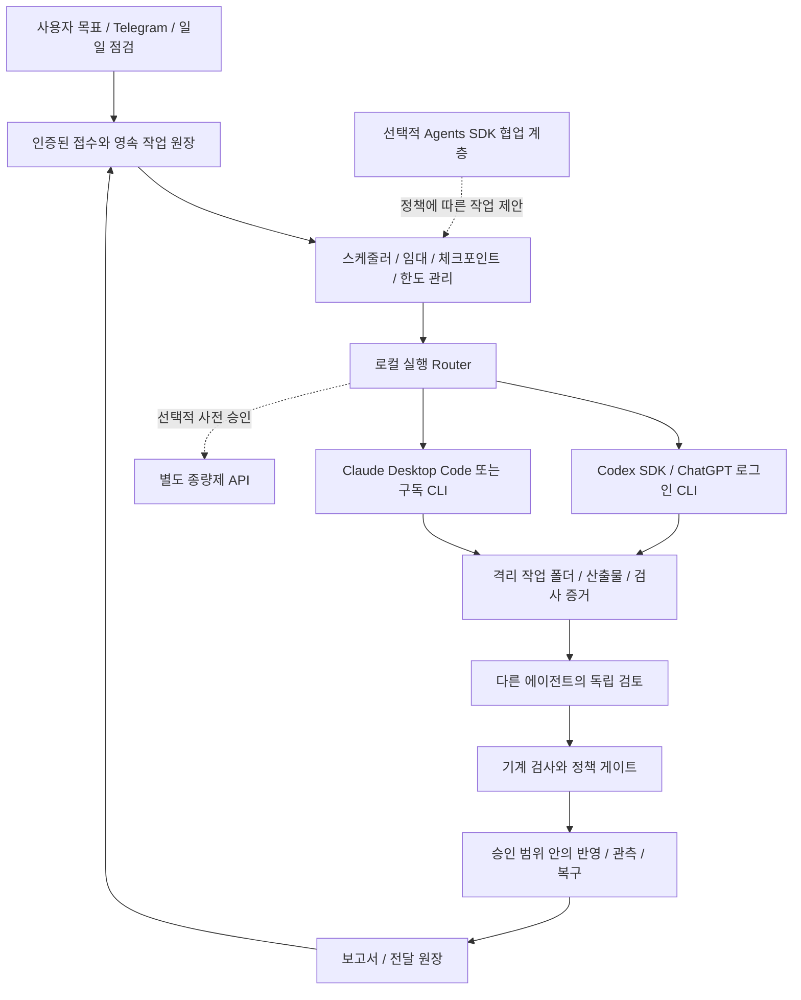

# 개인 Agentic AI 통합 구현 핸드오프: 로컬 Codex·Claude + SDK

**2026-09-14 정책 변경: 시스템의 GPT는 `gpt-5.6-sol`만 사용한다. 아래 과거 Astra 권고는 적용하지 않는다. 최신 장애 진단과 수정 순서는 [Sol 전용 실행 진단](</Volumes/Realtek_NVME/AI System/handoff/AGENTIC_RUNTIME_DIAGNOSIS_SOL_ONLY_2026-09-14.md>)을 우선한다. 운영 설정 적용 완료를 의미하지 않는다.**

통합 설계: 2026-09-13 / 구현 완료 점검: 2026-09-13 / 상태: Codex SDK·CLI 영속 실행 계약 완료, Claude 비활성

이 문서는 로컬 우선 구현 계획과 SDK 적용 검토를 통합한 실행 설계 정본이다. 이전 문서의 실행 채널·인증·모델 연결·비용 계획과 충돌하면 이 문서를 우선한다. 별도 LLM API를 필수로 전제했던 판단을 정정한다. 목표 7개, 데이터 검증, 전략 연구, 증거 기반 승인 기준은 유지한다. 2026-09-13 재점검에서는 클로드가 앞서 반영한 구현을 코드·커밋·회귀 테스트와 대조했으며, 확인되지 않은 SDK 통합이나 운영 준비 상태를 완료로 올리지 않았다.

## 0. 2026-09-13 구현 재점검 인계

### 확인한 기준 파일

- `antigravity_workspace/llm_client.py`: 로컬 Codex/Claude CLI provider, provider 등급, 추론 캐스케이드
- `antigravity_workspace/memory/llm_usage_ledger.py`: 실제 응답 usage 원장과 provider별 월 비용 합계
- `antigravity_workspace/tests/test_h01_fixes.py`: H01 안전 결함, CLI adapter, 검증 등급, DeepSeek 예산 회귀 테스트
- 함께 확인한 실행 경로: `goal_verification.py`, `memory/goals_registry.py`, `agents/l2_workers/codex_builder.py`, `agents/l2_workers/claude_reviewer.py`

### 코드와 커밋으로 확인된 완료 범위

| 범위 | 현재 구현 | 판정 |
|---|---|---|
| Codex 로컬 호출 | `codex exec -s read-only --json -o <temp>` 실행, 최종 텍스트와 `turn.completed` usage 회수, 임시파일 정리 | 1차 adapter 완료 |
| Claude 로컬 호출 | `claude -p --output-format json`, 변경 도구 비허용, 결과·usage 회수 | 계약 구현 완료, 독립 프로세스 실호출 미검증 |
| 검증자 분리 | 기본 쌍을 별도 thread의 `codex_sdk`와 `codex_cli`로 구성하고 draft provider 대체 차단 | 완료; 같은 공급자 계열 한계 명시 |
| 증거 결속 | 같은 `evidence_hash`에 대한 서로 다른 검증자 판정만 완료에 사용 | 회귀 테스트 완료 |
| 추론 우선순위 | opt-in 경로를 Codex SDK → Codex CLI → Claude → DeepSeek 순으로 구성 | 완료 |
| 비용 제한 | DeepSeek 월 10,000원 상당의 추정 상한, provider별 월 합계, 동시 요청 비용 예약·정산 | 완료 |
| 안전 게이트 | 스캐폴드·비 diff 응답·테스트/반영 절차 없는 패치의 자동 머지 차단 | 완료 |

관련 커밋은 `0ea3802`(LLM/usage), `bd3aa15`(동일 증거·diff 검토), `e7f8e8e`(로컬 CLI), `ba259ea`(추론 순위·DeepSeek 예산)다.

### 이번 재점검 결과

- Codex CLI `0.154.0-alpha.6.2`, `Logged in using ChatGPT`를 다시 확인했다.
- Claude CLI `2.1.71`은 현재 셸에서 `loggedIn:false`, `authMethod:none`이며 사용자의 확인에 따라 현재 토큰이 없다. 기본 완료 검증 경로에서 제외하되 adapter 코드는 보존했다.
- 공식 Python SDK `openai-codex==0.154.0`을 가상환경과 `requirements.txt`에 고정했다. `execution/codex_sdk.py`가 thread 시작·재개, run 원장, artifact/hash, 인증 대기, 중단 후 reconcile을 제공한다.
- 실제 SDK 종단 검증에서 새 thread 생성과 동일 session resume가 모두 `SUCCEEDED`였고 artifact hash도 재검증됐다. 시험 session은 `01a09840-d599-7703-adb8-9ecbfa4ef0da`다.
- Claude 대신 `codex_sdk`와 `codex_cli`의 별도 세션을 기본 완료 검증 쌍으로 사용한다. 같은 공급자 계열이라는 한계를 `same_vendor_distinct_sessions`로 기록하며 draft 모델로 낮추지 않는다.
- DeepSeek 월 예산은 `BEGIN IMMEDIATE` 기반 비용 예약과 실제 usage 정산을 추가해 동시 호출의 상한 경쟁 조건을 차단했다.
- 기존 전체 테스트를 가상환경에서 재실행한 결과 최초 97개 중 1개가 실패했다. 원인은 `tests/test_self_healing.py`가 안전 게이트 도입 전의 자동 머지 동작을 기대하고 외부 LLM을 직접 호출하던 오래된 테스트였다. 테스트를 고정 응답 기반으로 바꾸고 자동 머지 차단을 기대하도록 수정했다. 관련 CLI·추론 순위·예산 테스트 21개와 전체 97개를 다시 실행해 모두 통과했다. 전체 검사는 66.479초가 걸렸으며, 격리되지 않은 임베딩/API 재시도 때문에 느린 점은 남아 있다.
- SDK adapter·resume·reconcile·인증 대기·예산 예약 테스트를 추가한 뒤 전체 103개를 다시 실행해 모두 통과했다(65.775초). `llm_client`의 실제 `codex_sdk` provider도 `CLIENT_SDK_OK`를 반환했고 run `run_1b48da4452e1497caa1439d81b6c746c`, session `01a09844-58ef-7063-b42b-eb708747a86a`, artifact hash `ffd9c5fcee64ec48a82ee4a2596e8f026faea9b4f371796acec5dda17a9c983b`를 확인했다.

### 남은 운영 과제

1. Claude 토큰이 다시 제공되면 `GOAL_VERIFIER_2=claude_cli`로 독립 공급자 검증을 복원하고 실제 fixture를 통과시킨다.
2. 기존 CLI adapter도 SDK adapter와 같은 영속 실행 클래스로 옮기면 CLI fallback의 명시적 resume/reconcile까지 대칭이 된다.
3. 네트워크와 운영 DB에 접속하지 않는 전체 회귀 프로필을 만들어 로컬 테스트가 외부 환경에 따라 느려지거나 달라지지 않게 한다.

## 1. 확인 결과와 정확한 판단

아래 표는 2026-09-12에 확보한 최초 관찰 기록이다. 현재 상태는 위 0절의 2026-09-13 구현 완료 점검을 우선한다.

| 항목 | 이번 확인 결과 | 해석 및 한계 |
|---|---|---|
| Codex 실행 파일 | `/Applications/ChatGPT.app/Contents/Resources/codex` | 실행 경로를 발견할 수 있음. 과거 `Codex.app` 경로를 고정하지 않음 |
| Codex CLI 버전 | `0.154.0-alpha.6.2` | 설치 및 help 실행 확인. 운영 작업 성공 시험은 미실시 |
| Codex 인증 | `codex login status`: `Logged in using ChatGPT` | 별도 OpenAI API 키 없이 구독 인증 경로를 사용할 기반 확인 |
| Codex 비대화형 기능 | 설치 버전 help에 `exec`, `--json`, `--output-schema`, `resume`, `--worktree` | 영속 스케줄러와 구조화 결과를 연결할 수 있는 인터페이스 존재 |
| Claude CLI | `/opt/homebrew/bin/claude`, `2.1.71` | `-p`, JSON/stream-json, session ID/resume, 도구 권한 옵션 확인 |
| Claude CLI 인증 | 현재 도구 셸에서 `loggedIn:false`, `authMethod:none` | 이 셸의 인증 결과. 앱 전체 또는 다른 실행 환경이 미로그인이라는 뜻은 아님 |
| Claude Desktop | 실행 중이며 접근성 트리에서 AI System의 Code 세션, 입력란, 보내기 버튼, 원격 제어 UI 확인 | 로컬 앱의 관찰·제어 인터페이스 확인. 이번에는 입력·전송 동작을 시험하지 않음 |
| Claude 모델 | 현재 앱 표시 `Sonnet 5`, 노력 `높음`, 계정 표시 `Pro` | 해당 앱 세션의 표시. CLI에서 같은 모델에 접근 가능한지는 별도 확인 |
| Codex·Antigravity 앱 | 앱 목록에서 `com.openai.codex`, `com.google.antigravity-ide` 실행 중 확인 | 앱 존재·실행 확인이며 무인 데몬의 제어 능력 인증은 아님 |
| 기존 목표 접수 | Claude 앱에 표시된 최근 설명에서도 접수·원장 기록 뒤 실제 실행 단계는 다음 단계라고 명시 | 기존 정적 검토와 부합. 대화 설명 자체를 실행 로그로 간주하지 않음 |

**현재 결론:** 별도 API 키 없이 기존 ChatGPT 로그인으로 Codex SDK와 CLI를 실행할 수 있다. SDK 실행 결과와 세션·turn·artifact hash는 원장에 연결됐다. 전체 업무 스케줄러, CLI 대칭 resume/reconcile, Claude 독립 공급자 검증은 아직 후속 범위다.

여기서 “로컬”은 클라이언트와 작업 파일이 Mac에 있다는 의미다. Codex/Claude의 추론까지 Mac에서 수행되거나 인터넷 없이 동작한다는 의미는 아니다. 구독 사용에는 한도와 서비스 가용성 제약이 있다. [Codex 인증 방식](https://learn.chatgpt.com/docs/auth), [Claude 인증 방식](https://code.claude.com/docs/en/authentication).

## 2. 수정된 아키텍처

Antigravity는 접수·일정·상태 전이를 조정한다. Codex와 Claude는 작업을 수행하고 검토한다. DB 검사·백테스트·실험 판정은 재현 가능한 프로그램이 수행한다. 자연어 완료 보고만으로 성공을 기록하지 않는다. 목표 1·2·4·7의 조사/검증 결과가 목표 5·6의 개선 큐로 들어가도록 연결한다. 자동매매 준비 목표 3은 기존 실제 자금 연동 보류를 유지한다.

## 3. SDK 적용 결정과 경계

### 3.1 구성요소를 구분한다

| 구성요소 | 제공하는 기능 | 이 시스템의 결정 |
|---|---|---|
| Codex CLI | 로컬 에이전트 실행·구조화 출력·세션 재개 | 초기 기준 실행 경로. 기존 ChatGPT 로그인 활용 |
| Codex SDK | 애플리케이션에서 로컬 Codex 세션을 시작·계속·재개 | Python 0.154.0 채택. 영속 run·resume·artifact 검증 연결 |
| OpenAI Agents SDK | 에이전트 정의·도구 연결·실행 조정·협업과 관측 기능 | 선택적 협업 계층. 핵심 원장·승인 정책과 분리 |
| OpenAI Agents API | OpenAI가 관리하는 에이전트 실행·세션·복구 | 별도 API 도입을 선택할 때의 확장안. 로컬 구독 기본안의 필수 의존성 아님 |
| App Server | 인증·승인·이벤트 등을 다루는 Codex 프로토콜 | 직접 연결은 실험 평가 범위. 운영 기본 경로로 즉시 채택하지 않음 |
| MCP 도구 서버 | DB 검사·검색·보고 등 도구를 표준 인터페이스로 제공 | 필요 시 공통 업무 도구에 적용. Codex 자체를 MCP 서버로 노출하는 과거 방식과 구분 |

SDK는 모델 자체나 사용권이 아니다. 공개 소프트웨어를 사용해도 모델 호출의 인증·요금·자료 전송 정책은 따로 적용된다. Agents SDK를 설치하면 ChatGPT/Claude 구독이 자동으로 모델 provider가 되는 것으로 가정하지 않는다. 이 문서는 모델 가중치 공개나 AGI/ASI 수준 도달을 의미하지 않는다.

근거: [Agents SDK](https://developers.openai.com/api/docs/guides/agents/sdk), [Codex SDK](https://learn.chatgpt.com/docs/codex-sdk), [Agents API](https://developers.openai.com/api/docs/guides/agents-api/overview).

### 3.2 Codex SDK 도입 기준

공식 문서는 TypeScript `@openai/codex-sdk`와 Python `openai-codex`를 안내한다. TypeScript는 로컬 thread 시작·재개를 제공하고, Python은 로컬 App Server의 JSON-RPC를 제어하며 배포본에 고정된 CLI 런타임 의존성이 포함된다고 설명한다. 현재 업무 제어 코드가 Python 중심이므로 Python SDK 0.154.0을 채택했다. [공식 SDK 설명](https://learn.chatgpt.com/docs/codex-sdk).

특히 공식 SDK 페이지는 Python SDK를 stable로 설명하지만, MCP 제거 안내는 App Server 명령을 experimental·production 미지원으로 설명한다. 패키지의 배포 상태와 하위 프로토콜의 운영 보장을 동일시하지 않는다. 현재 고정 버전은 실제 thread 시작·재개와 계약 테스트를 통과했으며, 버전 변경 시 같은 검사를 반복한다.

이번 구현에서 1~4의 기본 경로를 확인했다. 5는 버전 변경과 운영 전환 때 반복한다.

1. SDK 버전·런타임 버전·실행 파일·인증 모드를 기록한다. SDK가 사용하는 런타임이 앱 번들 CLI와 같다고 가정하지 않는다.
2. 현재 ChatGPT 구독 인증으로 실행 가능한지 확인한다. API 키가 필요하거나 과금 모드가 바뀌면 묵시적으로 전환하지 않는다.
3. 같은 fixture 작업에 대해 CLI와 SDK의 산출물·세션 ID·오류·권한 동작을 비교한다.
4. 작업 중단, 세션 재개, 인증 만료, 한도 소진, 잘린 출력, SDK 업데이트 후 복구를 확인한다.
5. 통과한 버전 조합을 고정하고 변경 때 계약 검사를 반복한다. 실패 시 원장의 실행 정보를 유지한 채 기존 경로로 조정한다. 제출 여부가 불명확한 작업을 다른 경로로 곧바로 중복 실행하지 않는다.

### 3.3 Agents SDK를 넣는 위치

기본안 A는 **로컬 스케줄러 + Codex/Claude 실행 adapter**다. 스케줄러는 Python 코드로 상태를 관리하고, 판단이 필요할 때만 로컬 클라이언트에 작업을 요청한다. 이 구조만으로도 계획·실행·검토·재개가 연결되면 Agentic AI가 된다.

선택안 B는 **Agents SDK를 협업 계층에 추가**하는 것이다. 연구·코드 수정·검토 등 역할 분배에 활용하되 다음 세 가지를 먼저 정한다.

- 감독 에이전트의 모델 실행 경로: 기본 API provider를 사용하면 별도 API 인증/사용량이 발생할 수 있다. 구독만 사용하는 요건과의 적합성을 먼저 평가한다.
- 로컬 Codex/Claude 연결: 각 adapter를 업무 도구처럼 호출할 수 있지만 이를 등록하는 것만으로 감독 에이전트의 추론 인증까지 해결되지는 않는다. 구독 CLI를 임의로 model provider처럼 감싸는 방식은 검증된 기본안으로 제시하지 않는다.
- 추적과 상태: SDK trace는 작업 관측 자료이며 승인 원장을 대체하지 않는다. 외부 trace 전송 설정을 확인하고 개인 문서·프롬프트·도구 결과의 무단 전송을 막는다. 로컬 감사 기록을 기본으로 유지한다.

단순히 SDK를 추가하기 위해 두 개의 감독 루프를 만들지 않는다. 목표 우선순위·작업 소유·재시도·최종 승인 상태는 단일 원장에서 관리한다. Agents SDK는 작업을 제안하거나 위임하고, 원장 정책이 실제 수행 가능 여부를 결정한다. SDK가 주는 편의가 복잡성과 비용을 줄이는지 비교한 뒤 채택한다.

### 3.4 오래된 MCP 예제와 앱 제어의 차이

현재 공식 문서는 `codex mcp-server` 및 별도 바이너리가 제거됐으며, 과거 Agents SDK 연결 예제도 더 이상 지원되지 않는다고 안내한다. 이를 새로운 구현의 기반으로 복사하지 않는다. 외부 MCP 도구를 Codex에서 사용하는 기능은 별개로 유지된다고 설명한다. [공식 제거·이전 안내](https://learn.chatgpt.com/docs/mcp-server).

App Server 연결이 Claude 데스크톱 UI나 macOS 모든 앱을 자동으로 제어하는 것은 아니다. UI 업무에는 이미 관찰한 접근성 제어 adapter가 필요하다. SDK·CLI·UI 경로는 동일 결과 계약으로 묶되 실패 유형과 인증 상태는 각각 기록한다.

### 3.5 파일 구조와 책임

아래 중 `execution/contracts.py`와 `execution/codex_sdk.py`는 이번에 구현했다. 나머지는 후속 모듈이며 기존 `llm_client.py`와 목표 원장은 유지한다.

| 논리 모듈 | 책임 |
|---|---|
| `execution/contracts.py` | 실행 요청·결과·오류·capability 스키마 |
| `execution/codex_cli.py` | JSONL 회수·명시적 세션 재개·취소 |
| `execution/codex_sdk.py` | 통과한 SDK 버전의 연결과 CLI 대비 계약 준수 |
| `execution/claude_local.py` | 앱/CLI 실행 모드·인증 상태·결과 회수 |
| `execution/ui_adapter.py` | UI 잠금·프로젝트/세션 대조·전송 조정 |
| `orchestration/scheduler.py` | 큐·lease·한도·재개·일일 목표 선택 |
| `orchestration/agents_sdk_bridge.py` | 선택적 역할 위임. 최종 승인 권한 없음 |
| `verification/evidence_gate.py` | 동일 증거·기계 검사·독립 검토의 원자적 승인 |
| `reporting/outbox.py` | 보고서 생성과 승인된 채널의 중복 없는 전달 |

SDK/CLI/UI 공통 adapter는 `capabilities`, `submit`, `observe`, `resume`, `cancel`, `reconcile`에 해당하는 기능을 제공하도록 설계한다. 실제 라이브러리에 같은 이름의 함수가 있다고 가정하지 않는다. 각 경로의 이벤트를 공통 상태로 변환하고 raw 이벤트는 비밀정보를 제거해 보존한다.

## 4. 실행 채널 선택

### Codex

기본 경로는 공식 Python Codex SDK이며 기존 ChatGPT 로그인으로 실제 thread 시작과 재개를 확인했다. SDK adapter는 run ID, session/thread ID, turn ID, artifact hash와 usage를 원장에 연결한다. 기존 `codex exec --json` 경로는 별도 검증 세션과 fallback으로 유지한다. 두 경로 모두 읽기 전용이 기본이며 앱 업데이트 후 계약 검사를 반복한다. [Codex 비대화형 실행](https://learn.chatgpt.com/docs/non-interactive-mode).

앱 전용 기능은 지원되는 앱 도구를 먼저 사용한다. 현재 Codex 대화에서 사용할 수 있는 작업 제어 도구가 외부 Python 데몬에도 자동 제공된다고 가정하지 않는다. 이번 검증은 비운영 읽기 전용 SDK thread만 생성했으며 별도 사용자 작업이나 외부 전송은 만들지 않았다.

### Claude

Claude adapter 코드는 보존하지만 현재 CLI는 미인증이며 사용자가 토큰 부재를 확인했다. 기본 실행·검증 경로에서는 제외한다. 토큰이 다시 제공되면 동일 사용자·실행 환경에서 정식 로그인을 확인하고 독립 공급자 검증을 복원한다. 앱의 로그인 토큰을 추출해 임의 API 호출에 재사용하지 않는다.

CLI adapter는 `claude -p --output-format json` 계약을 유지한다. 인증 복원 후 명시적 `--resume`, JSON 구조, 오류 처리, 허용 도구 범위를 설치 버전에서 다시 시험한다. [Claude 프로그램 실행](https://code.claude.com/docs/en/headless).

### 앱 제어 adapter

기존 UI 제어 기능은 앱 전용 작업, 세션 확인, 화면 기반 업무에 활용한다. 다음을 구현 수락 조건으로 둔다.

- bundle ID·프로젝트·세션 ID를 확인한 뒤 입력한다. 사용자 작성 중인 초안이나 다른 업무 세션을 덮어쓰지 않는다.
- UI 접근성 요소를 우선 사용하고 각 행동 뒤 상태를 다시 읽는다. 고정 좌표나 일정 시간 경과만으로 완료를 판단하지 않는다.
- foreground 입력 잠금을 두어 Codex·Claude·사용자가 동시에 같은 입력기를 조작하지 않게 한다.
- 제출 전 dispatch intent를 원장에 기록한다. 전송 성공 여부가 불명확하면 기존 세션에서 작업 ID를 조회·대조한 뒤 재전송을 결정한다.
- UI의 idle/완료 표시와 함께 run ID가 포함된 산출물·파일 hash·검사 결과를 대조한다. 판단이 불가능하면 `NEEDS_RECONCILIATION`으로 보존한다.
- 로그아웃·잠금 화면·권한 팝업·앱 충돌 시 `WAITING_AUTH` 또는 `WAITING_UI`로 정지한다. 맹목적으로 키 입력을 반복하지 않는다.
- 현재 대화의 UI 제어 권한과 부팅 후 scheduler의 권한은 따로 확인한다. 로그인 세션이 필요한 UI 작업의 가용 시간을 기록한다.

## 5. 모델과 독립 검토

| 역할 | 로컬 기본 배치 | 승격·확인 기준 |
|---|---|---|
| 목표 분해·설계·중요 원인 분석 | Codex의 GPT-6 Astra 후보 | 현재 Codex 도구가 지원 후보로 안내함. 계정 및 선택 실행 경로에서 응답 모델 확인 후 고정 |
| 일상 수정·문서 초안 | Claude Desktop Code Sonnet 5 | 이번 앱에서 선택 표시 확인. 성공률과 한도 실측 |
| 복잡한 변경 | 계정에서 사용 가능한 Claude Opus 5 또는 Astra | 접근 여부·품질 평가 후 배치. 설치만으로 모델 사용 가능하다고 가정하지 않음 |
| 독립 검토 | 저자가 Claude면 Codex, 저자가 Codex면 Claude | 별도 검토 세션, 같은 불변 증거, 이전 판단에 의한 편향 최소화 |
| 일반 분류·요약 | 기존 두 클라이언트에서 사용 가능한 평가 통과 모델 | 모든 뉴스에 최고 추론을 쓰지 않고 배치·캐시 활용 |

API 전용 모델 ID를 앱/CLI 모델 선택기에 그대로 적용하지 않는다. requested/resolved 모델이 다르면 기록하고 검증 정책을 다시 확인한다. 독립성은 모델 두 개의 이름만으로 성립하지 않는다. 이미 둘 다 구현에 참여했다면 중요 변경은 별도의 검토 run을 확보하고 검토 오염을 명시한다. 두 독립 승인 정책을 충족할 수 없으면 배포 대기하며, 다수결로 기계 검사 실패를 무시하지 않는다.

## 6. 실행 계약과 상태 전이

각 dispatch에 최소 `task_id`, `run_id`, `attempt_id`, `role`, `transport`, `workspace`, `spec_hash`, `input_hash`, `session_id`, `requested_model`, `resolved_model`, `auth_mode`, `started_at`, `heartbeat_at`, `status`를 저장한다. 비밀정보는 저장하지 않는다. 결과에는 artifact 경로/hash, source commit, data snapshot, test exit/result, 오류 유형, usage 출처를 연결한다. 없는 provider request ID는 꾸며내지 말고 null로 둔다. 로컬 attempt ID와 provider ID를 구분한다.

상태: `QUEUED → LEASED → RUNNING → RESULT_RECEIVED → VALIDATING → REVIEWING → READY_TO_APPLY → APPLIED → OBSERVING → SUCCEEDED`. 인증·한도·UI·검토 충돌 대기는 별도 상태로 보존한다. 프로세스 종료 0은 RESULT_RECEIVED 조건 중 하나이며 목표 성공 판정은 아니다. SQLite 트랜잭션과 lease 만료 처리로 한 작업의 중복 소유를 막는다.

재시작 시 완료된 부작용을 다시 실행하지 않는다. artifact·commit·전달 ID를 대조해 재개하며, 전달 결과가 불명확하면 중복 발송보다 조정을 우선한다. 세션 재개가 불가능하면 새 세션에 체크포인트를 제공하고 이전 attempt와 연결한다. 전역 최근 세션을 자동 선택하면 다른 목표가 섞이므로 피한다.

기존 `claude_reviewer.py`의 AST/regex는 정적 검사기로 유지하되 이름과 실제 기능을 일치시킨다. 별도 Claude 실행 adapter를 붙여야 실제 AI 검토가 된다. diff는 격리 checkout에 적용한 결과 파일을 검사한다. 현재 run의 evidence hash·spec hash가 같은 승인만 원자적으로 반영한다. R01~R09의 기존 상태/증거 결함은 채널 변경과 별개로 수정한다.

## 7. 구독 운영·개인정보·복구

LLM API fallback 기본값은 disabled다. 한도 도달 시 `WAITING_QUOTA`로 저장하고 알려진 재설정 시각에 재개한다. 한도 정보가 없으면 unknown으로 표시하고 제한된 backoff를 사용한다. 구독 토큰에 API 가격을 곱해 청구액으로 표시하지 않는다. 앱 화면의 일회성 사용률도 지속적인 quota API처럼 취급하지 않는다.

우선순위는 장애·데이터 오염 차단, 예약 브리핑, 진행 중 연구, 선택적 개선 순으로 시작하고 사용자 중요도를 반영한다. 연속 연구 목표는 예산 안에서 반복하며, 매일 코드 변경을 강제하지 않는다. 변화 없음도 유효한 결과다. 추가 사용 과금·크레딧·자동 충전은 별도 승인 범위 없이 실행하지 않는다.

Mac의 재부팅·외장 SSD 미마운트·슬립·네트워크 장애를 각각 점검한다. 데이터 경로가 없으면 빈 DB를 자동 생성해 정상으로 오인하지 않는다. 서비스 재시작/OS 설정 변경은 후속 구현 항목이다. 로컬 앱을 사용해도 개인 자료는 클라우드 모델로 전달될 수 있으므로 자료별 허용 공급자·보존·전송 범위를 유지한다. API용 데이터 정책이 구독에도 같다고 가정하지 않는다.

## 8. 구현 순서와 수락 기준

| 순서 | 구현 내용 | 완료 증거 |
|---|---|---|
| 1 | 실행 채널 등록 및 탐지 | 실행 파일·버전·인증 모드·앱/CLI 구분·모델 후보, 비밀정보 없는 capability report |
| 2 | Codex SDK 실제 dispatch와 CLI 보조 경로 | 완료: run ID → 실제 session/turn → artifact hash → reconcile, 동일 session resume 확인 |
| 3 | Claude 앱 경로 연결, 필요 시 구독 CLI 정식 인증 | 같은 fixture의 실제 실행과 결과 회수. CLI 미인증을 앱 불능으로 표시하지 않음 |
| 4 | 영속 큐·lease·명시적 세션 재개 | 실행 중 중단 후 재시작해 중복 수정/전송 없이 복구 |
| 5 | 독립 검토·동일 증거 승인 게이트 | 이전 run 승인 재사용·기계 검사 실패·가짜 완료를 모두 차단 |
| 6 | stock 데이터·전략 검증 루프 | 데이터 snapshot/PIT 검사, 비용·누수 통제 실험, 보류된 실제 자금 연결 유지 |
| 7 | Market Intelligence·개인 지식·브리핑 | 원문/시각/출처 연결, 사실·추정 구분, 전달 중복 방지, 사용자 피드백 반영 |
| 8 | 일일 자가진단·개선·복구 | 작은 변경을 격리 시험·검토·허용 범위 반영 후 관측하고 실패 시 복구 |
| 9 | 7일 관측 후 SDK 협업·용량 판단 | 구독 소진·완료 시간·실패율·검토 오류를 측정해 Agents SDK의 효용과 추가 API 필요성을 판단 |

필수 장애 시험: 인증 만료, 한도 소진, JSON 잘림, 앱 세션 오선택, 전송 후 결과 회수 실패, 작업 프로세스 중단, 같은 목표 중복 수신, 외장 SSD 미마운트, 이전 증거에 대한 승인 재사용. 시험은 비운영 fixture에서 먼저 수행한다. 이번 문서 수정 단계에서는 수행하지 않았다.

## 9. 7개 목표의 업무 루프와 완료 기준

| 목표 | 지속 실행할 업무 | 승인 가능한 증거 |
|---|---|---|
| 1. 주식 데이터 무결점 | 원천 수집 → 단위/누락/중복/시점 검사 → 이상 격리 → 원인 개선 | 날짜·시장·종목·컬럼 범위를 고정한 검사 결과. 보편적 무결점 대신 해당 범위 PASS/미확인 명시 |
| 2. 800% 이상 전략 연구 | 가설 등록 → 비용 반영 → 누수 통제 → 비중복 walk-forward → 모의 운용 → 재평가 | 목표 기간·위험 상한·거래 비용을 사전 고정한 실험과 보류 표본 성과. 수익 보장 금지 |
| 3. 자동매매 가능 수준 준비 | 주문·체결·잔고 대조와 재시도/중복 주문 시험 | 모의 환경의 주문 원장·장애 복구. 실제 자금 연동 보류 유지 |
| 4. Market Intelligence | 원문 수집 → 출처·시각 대조 → 사건/기업 연결 → 사용자 의미 분석 | 원문으로 추적 가능한 주장과 상충 근거·불확실성 |
| 5. 자가진단·개선 | 이상 감지 → 재현 → 격리 수정 → 독립 검토 → 제한 반영 | 재현 검사와 수정 후 회귀 결과·관측·복구 가능성 |
| 6. 자동 확장 | 개선 제안 → 가치/비용 평가 → 작은 실험 → 기준 통과 후 확장 | 기능 수가 아닌 사용자 효용·성공률·비용 변화 |
| 7. 고급 의사결정 브리핑 | 경제/주식/방산/지정학 통합 → 시나리오 → 판단 질문 → 문서·원격 보고 | 사실/추정/권고 구분, 출처, 기준 시각, 반대 근거, 전달 기록 |

## 10. 2026-09-13 운영 점검 및 보강

- 모델 단계는 `GPT 계획 → Gemini 자료·맥락 보강 → Qwen 단순 전처리 → DeepSeek 전처리 검사·Claude 입력 초안 → Claude 독립 검증·보강 → GPT 최종 검수`로 고정했다. Qwen은 분류·중복 제거·필드 추출·형식 변환만 수행하며 설계, 코드 변경, 완료 판정, 다음 단계 승계 권한이 없다.
- 어느 단계든 사용 한도에 도달하면 `WAITING_QUOTA`에서 멈춘다. 낮은 모델로 중요한 판단을 우회하지 않으며, 같은 단계의 사용 가능 모델 또는 해당 모델의 한도 복구 뒤에만 재개한다.
- 기존 Telegram의 “Qwen으로 이어받기” 전송 API는 중단 상태(HTTP 410)로 바꾸고 관리자 인증을 적용했다. 점검 당시 해당 알림 데몬과 7개 목표 scheduler는 실행 중이지 않았다.
- 7개 목표는 원장에 등록돼 있지만 `auto_continue=false`로 확인됐다. 동시에 여러 목표를 실행하지 않도록 scheduler는 한 번에 하나만 예약하며, 전체 자동 활성화는 외부 모델/API 사용량을 발생시키므로 별도 운영 승인이 필요하다.
- 외부 KAI 페이지에 `CEO 인사이트` 화면과 NotebookLM용 원문 소스북 생성 API를 추가했다. 뉴스 URL·발행처·시각·로컬 연구 PDF를 보존하고 SHA-256을 기록한다. NotebookLM이 실제로 생성하지 않은 결과는 인포그래픽으로 표시하지 않는다.
- 현재 뉴스 DB는 방산·국내 자료 비중이 높다. 화면과 소스북에 `LIMITED_SOURCE_MIX`를 표시해 세계 경제·AI 수집원이 충분하지 않은 상태를 숨기지 않는다. 국제 경제기관, 주요 경제지, AI 연구기관 원문 수집 확대가 다음 데이터 작업이다.

7개 목표는 같은 우선순위로 무한 반복하지 않는다. 데이터 오염과 운영 장애를 먼저 처리하고, 브리핑 마감과 연구 예산을 배분한다. 계속 진행하는 목표는 전체를 영구 COMPLETED로 닫기보다 일별/실험별 run을 종료하고 목표 상태는 유지한다.

개인 기억은 명시 선호·목표·과거 결정·근거·결과를 분리해 버전으로 저장한다. 모델이 추정한 선호는 사용자 확정 선호와 구분하고 수정·삭제 가능하게 한다. 검색에서 출처와 접근 권한을 이어받으며, “사용자와 동일하게 생각함”은 피드백으로 의사결정 지원 품질을 높이는 목표로 운영한다.

## 10. 최초 종단간 검증 시나리오

첫 시나리오는 운영 DB 복사본 또는 합성 fixture의 가격 데이터 이상 1건이다. 전체 데이터 보정이나 실매매부터 시작하지 않는다.

1. 누락·중복·가격 단위 오류 중 하나를 주입한 fixture와 정답을 준비한다.
2. 검사기가 이상을 감지하고 goal/task/run ID를 생성한다.
3. Codex 또는 Claude가 원인과 작은 수정안을 격리 폴더에서 작성한다.
4. 프로그램 검사를 실행하고 evidence bundle을 고정한다.
5. 다른 에이전트가 원문·diff·검사 결과를 읽어 독립 검토한다.
6. 허용된 fixture에만 반영하고 요약 보고서를 생성한다. 외부 전송은 기존 승인 범위 안에서만 시험한다.
7. 중단·한도 소진·중복 수신을 넣어 재개와 중복 방지를 확인한다.

수락 기준은 실제 세션과 산출물 연결, 같은 run의 승인, 결함 탐지, 데이터/코드 지문, 재시작 후 일관성이다. SDK 설치 성공이나 에이전트의 “완료” 문장만으로 통과하지 않는다. 실패 시 CLI/SDK/모델/업무 도구 중 어느 계층이 원인인지 분리한다.

## 11. 후속 구현자에게 전달할 지시

> AGENTIC_AI_LOCAL_SDK_INTEGRATED_HANDOFF_2026-09-12.md를 실행 설계 정본으로 적용하세요. Codex SDK 0.154.0의 영속 adapter를 기본으로 사용하고 Codex CLI를 별도 세션 검증과 fallback으로 유지하세요. Claude 토큰이 없으므로 현재 기본 검증 쌍은 Codex SDK+CLI이며 `same_vendor_distinct_sessions` 한계를 숨기지 마세요. Agents SDK는 선택적 협업 계층이며 원장·기계 검사·승인 게이트를 대체하지 않습니다. 동일 evidence hash와 spec hash에 대한 승인만 허용하고, 한도 소진 시 작업을 보존하세요. 실제 자금 연결 보류를 유지하며 결과는 변경 diff·검사·실제 세션·산출물 지문·복구 증거로 인계하세요.

관련 상세 검토: [7대 목표 및 결함 검토](</Volumes/Realtek_NVME/AI System/handoff/AGENTIC_AI_7_GOALS_MODEL_REVIEW_2026-09-12.md>), [전체 아키텍처](</Volumes/Realtek_NVME/AI System/handoff/PERSONAL_AI_ARCHITECTURE_HANDOFF_2026-09-12.md>).

## 12. 인계 산출물과 문서 사용 순서

후속 구현 완료 보고에는 변경 파일/diff, 적용한 SDK·CLI 버전, 인증 모드(비밀값 제외), 계약/장애 검사 결과, 실제 세션과 run ID, artifact/evidence hash, 남은 결함, 운영 반영 범위와 복구 절차를 포함한다. 평가되지 않은 모델·Agents SDK·앱 자동화는 미검증으로 표시한다.

읽는 순서는 이 통합 계획 → 7대 목표 및 R01~R09 검토 → 전체 아키텍처 상세다. 앞선 코드 관찰은 시간에 따라 달라질 수 있으므로 구현 시작 시 해당 파일의 최신 상태를 다시 확인한다. 2026-09-13에는 SDK 설치·영속 adapter·LLM client 연결·예산 예약·회귀 테스트·읽기 전용 실제 실행까지 완료했다. 서비스 재시작, 로그인 변경, 자동화 등록, 외부 보고 전송은 수행하지 않았다.

## 13. 2026-09-13 외부 AGI 관제 구현 결과

외부 운영 주소는 `https://newsinfo.cloud/kai/#system`이다. 이 화면에서 새 과업을 입력하고, 기존 7개 목표를 선택해 설명·성공 기준·자동 계속 여부를 수정하며, 모델 상태와 작업 이력을 새로고침할 수 있다. 쓰기 요청은 `/app-login`이 발급한 관리자 세션 Bearer 토큰이 있어야 하며 공개 사용자는 상태와 증거만 읽을 수 있다.

운영 상태 머신은 다음 순서를 강제한다. 1·5단계는 `CodexSDKAdapter`를 통해 공식 `openai-codex` SDK와 영속 실행 원장을 사용한다.

1. GPT/Codex가 높은 사고 수준의 계획과 완료 기준을 만든다.
2. Gemini CLI가 근거와 대용량 컨텍스트를 정리한다.
3. 로컬 Qwen이 실행안을 만들고 DeepSeek가 독립 검증·통합한다.
4. Claude가 앞선 산출물을 확인하고 보강한 적용 가능 후보를 완성한다.
5. GPT/Codex가 전체 증거를 최종 검수해 PASS 또는 REVISE를 판정한다.

각 단계는 파일 산출물과 SHA-256 지문을 저장해야 다음 단계가 열린다. 실제 요청에서 인증 또는 한도 오류가 나오면 `WAITING_AUTH` 또는 `WAITING_QUOTA`로 같은 단계에 머무른다. 알려진 재설정 시각 또는 보수적인 5시간 후에 60초 감시기가 재시도한다. 다음 공급자로 우회해 단계를 건너뛰지 않는다. 동시에 한 작업만 실행한다.

구현 파일은 [strict_agi_orchestrator.py](</Volumes/Realtek_NVME/AI System/codex/ceo-briefing-platform/backend/strict_agi_orchestrator.py>), API는 [main.py](</Volumes/Realtek_NVME/AI System/codex/ceo-briefing-platform/backend/main.py>), 외부 화면은 [kai.js](</Volumes/Realtek_NVME/AI System/codex/ceo-briefing-platform/frontend/kai.js>)다. 영속 상태와 산출물은 Git에서 제외한다.

현재 안전 경계도 명시한다. 외부 데몬의 Claude 단계는 `plan` 모드이므로 산출물을 직접 워크스페이스에 적용하지 않는다. 기존 7개 목표의 자동 계속은 기본 OFF다. 운영자가 외부 화면에서 특정 목표를 선택하고 체크박스를 켜 저장하면 그 목표만 6시간 간격으로 직렬 실행된다. 이는 공개 서비스가 검토 없이 파일을 바꾸거나 7개 목표 전체의 구독 자원을 무한 소진하지 않도록 한 경계다.

검증 결과: Python/JavaScript 구문 검사 통과, 세션 인증·기존 쿼터 관리자·신규 단계 게이트 합계 21개 단위 테스트 통과, 외부 API에서 5개 공급자와 5단계 파이프라인 및 7개 목표 응답 확인, 미인증 과업 등록 HTTP 401 확인. 구독 CLI는 남은 메시지 수를 제공하지 않으므로 화면은 잔여 퍼센트를 꾸미지 않고 로그인 상태와 실제 한도 오류만 표시한다.

이 상태를 완전한 AGI로 판정하면 안 된다. 목표 기반 영속 실행, 재개, 다중 모델 검토, 원격 관제의 운영 골격은 구현됐지만 모델 산출물의 실제 코드·데이터 반영은 제한되어 있고, 장기 무인 관측, 장애 복구, 목표 성공의 외부 검증이 끝나지 않았다.
