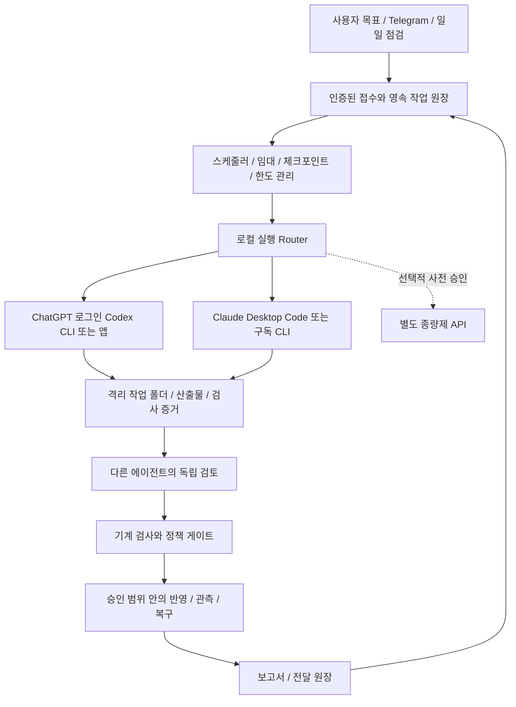

# 로컬 Codex·Claude 우선 Agentic AI 구현 계획

**2026-09-14 정책 변경: 시스템의 GPT는 `gpt-5.6-sol`만 사용한다. 아래 과거 Astra 권고는 적용하지 않는다. 최신 장애 진단과 수정 순서는 [Sol 전용 실행 진단](</Volumes/Realtek_NVME/AI System/handoff/AGENTIC_RUNTIME_DIAGNOSIS_SOL_ONLY_2026-09-14.md>)을 우선한다. 운영 설정 적용 완료를 의미하지 않는다.**

최신 통합 정본: [로컬 실행 + SDK 통합 구현 핸드오프](</Volumes/Realtek_NVME/AI System/handoff/AGENTIC_AI_LOCAL_SDK_INTEGRATED_HANDOFF_2026-09-12.md>). 실행 채널·SDK 도입·구현 순서는 통합 문서를 우선한다.

작성: 2026-09-12 / 상태: 검토 및 구현 핸드오프 / 운영 변경 없음

이 문서는 기존 두 핸드오프의 실행 채널·인증·모델 연결·비용 계획을 수정한다. 별도 LLM API를 필수로 전제했던 판단을 정정한다. 목표 7개, 데이터 검증, 전략 연구, 증거 기반 승인 기준은 유지한다. 사용자가 요청한 범위에 따라 이번에는 문서만 수정했으며 작업 실행, 로그인 변경, 자동화 등록, 앱에 프롬프트 전송을 하지 않았다.

## 1. 확인 결과와 정확한 판단

| 항목 | 이번 확인 결과 | 해석 및 한계 |
|---|---|---|
| Codex 실행 파일 | `/Applications/ChatGPT.app/Contents/Resources/codex` | 실행 경로를 발견할 수 있음. 과거 `Codex.app` 경로를 고정하지 않음 |
| Codex CLI 버전 | `0.154.0-alpha.6.2` | 설치 및 help 실행 확인. 운영 작업 성공 시험은 미실시 |
| Codex 인증 | `codex login status`: `Logged in using ChatGPT` | 별도 OpenAI API 키 없이 구독 인증 경로를 사용할 기반 확인 |
| Codex 비대화형 기능 | 설치 버전 help에 `exec`, `--json`, `--output-schema`, `resume`, `--worktree` | 영속 스케줄러와 구조화 결과를 연결할 수 있는 인터페이스 존재 |
| Claude CLI | `/opt/homebrew/bin/claude`, `2.1.71` | `-p`, JSON/stream-json, session ID/resume, 도구 권한 옵션 확인 |
| Claude CLI 인증 | 현재 도구 셸에서 `loggedIn:false`, `authMethod:none` | 이 셸의 인증 결과. 앱 전체 또는 다른 실행 환경이 미로그인이라는 뜻은 아님 |
| Claude Desktop | 실행 중이며 접근성 트리에서 AI System의 Code 세션, 입력란, 보내기 버튼, 원격 제어 UI 확인 | 로컬 앱의 관찰·제어 인터페이스 확인. 이번에는 입력·전송 동작을 시험하지 않음 |
| Claude 모델 | 현재 앱 표시 `Sonnet 5`, 노력 `높음`, 계정 표시 `Pro` | 해당 앱 세션의 표시. CLI에서 같은 모델에 접근 가능한지는 별도 확인 |
| Codex·Antigravity 앱 | 앱 목록에서 `com.openai.codex`, `com.google.antigravity-ide` 실행 중 확인 | 앱 존재·실행 확인이며 무인 데몬의 제어 능력 인증은 아님 |
| 기존 목표 접수 | Claude 앱에 표시된 최근 설명에서도 접수·원장 기록 뒤 실제 실행 단계는 다음 단계라고 명시 | 기존 정적 검토와 부합. 대화 설명 자체를 실행 로그로 간주하지 않음 |

**결론:** 로컬 설치된 AI 클라이언트를 활용할 기반은 있다. 별도 API가 없어서 구현할 수 없다는 판단은 부정확하다. 남은 핵심은 접수된 목표를 실제 로컬 에이전트에 배정하고, 그 결과와 검사를 원장에 연결하는 것이다. 현재 설치된 전체 시스템에 이미 이 연결이 완성됐다고 인증할 증거는 이번 확인에서 확보하지 못했다.

여기서 “로컬”은 클라이언트와 작업 파일이 Mac에 있다는 의미다. Codex/Claude의 추론까지 Mac에서 수행되거나 인터넷 없이 동작한다는 의미는 아니다. 구독 사용에는 한도와 서비스 가용성 제약이 있다. [Codex 인증 방식](https://learn.chatgpt.com/docs/auth), [Claude 인증 방식](https://code.claude.com/docs/en/authentication).

## 2. 수정된 아키텍처

Antigravity는 접수·일정·상태 전이를 조정한다. Codex와 Claude는 작업을 수행하고 검토한다. DB 검사·백테스트·실험 판정은 재현 가능한 프로그램이 수행한다. 자연어 완료 보고만으로 성공을 기록하지 않는다. 목표 1·2·4·7의 조사/검증 결과가 목표 5·6의 개선 큐로 들어가도록 연결한다. 자동매매 준비 목표 3은 기존 실제 자금 연동 보류를 유지한다.

## 3. 실행 채널 선택

### Codex

기본 후보는 현재 ChatGPT 로그인 CLI다. `codex exec --json`의 이벤트와 최종 산출물을 회수하고 명시적 session/thread ID를 저장한다. 새 작업은 격리 폴더에서 시작하고 재개는 해당 작업 ID에 연결된 세션만 사용한다. 설치 버전 help에 있는 옵션만 사용하며 앱 업데이트 후 계약 검사를 수행한다. [Codex 비대화형 실행](https://learn.chatgpt.com/docs/non-interactive-mode).

앱 전용 기능은 지원되는 앱 도구를 먼저 사용한다. 현재 Codex 대화에서 사용할 수 있는 작업 제어 도구가 외부 Python 데몬에도 자동 제공된다고 가정하지 않는다. CLI 또는 별도로 검증한 로컬 제어 adapter를 연결한다. 이 문서 작성 중에는 새 작업 생성·실행을 하지 않았다.

### Claude

현재 사용 중인 Desktop Code를 유효한 실행 경로로 인정한다. CLI 인증 미확인을 이유로 API 구매를 요구하지 않는다. 장시간 무인 작업에는 구조화 출력과 세션 ID를 제공하는 구독 CLI가 유리하므로, 구현 단계에서 동일 사용자·실행 환경의 정식 구독 로그인 가능 여부를 확인한다. 앱의 로그인 토큰을 추출해 임의 API 호출에 재사용하지 않는다.

CLI가 준비되면 `claude -p --output-format json`과 명시적 `--resume`을 adapter에 연결한다. 자동 승인 여부와 허용 도구 범위는 격리 작업 정책으로 정한다. 공식 문서는 설치된 2.1.71보다 뒤의 동작도 설명하므로 JSON 구조·오류 처리·스키마 검증은 설치 버전에서 시험해야 한다. 외부에서 결과 JSON을 다시 검증한다. [Claude 프로그램 실행](https://code.claude.com/docs/en/headless).

### 앱 제어 adapter

기존 UI 제어 기능은 앱 전용 작업, 세션 확인, 화면 기반 업무에 활용한다. 다음을 구현 수락 조건으로 둔다.

- bundle ID·프로젝트·세션 ID를 확인한 뒤 입력한다. 사용자 작성 중인 초안이나 다른 업무 세션을 덮어쓰지 않는다.
- UI 접근성 요소를 우선 사용하고 각 행동 뒤 상태를 다시 읽는다. 고정 좌표나 일정 시간 경과만으로 완료를 판단하지 않는다.
- foreground 입력 잠금을 두어 Codex·Claude·사용자가 동시에 같은 입력기를 조작하지 않게 한다.
- 제출 전 dispatch intent를 원장에 기록한다. 전송 성공 여부가 불명확하면 기존 세션에서 작업 ID를 조회·대조한 뒤 재전송을 결정한다.
- UI의 idle/완료 표시와 함께 run ID가 포함된 산출물·파일 hash·검사 결과를 대조한다. 판단이 불가능하면 `NEEDS_RECONCILIATION`으로 보존한다.
- 로그아웃·잠금 화면·권한 팝업·앱 충돌 시 `WAITING_AUTH` 또는 `WAITING_UI`로 정지한다. 맹목적으로 키 입력을 반복하지 않는다.
- 현재 대화의 UI 제어 권한과 부팅 후 scheduler의 권한은 따로 확인한다. 로그인 세션이 필요한 UI 작업의 가용 시간을 기록한다.

## 4. 모델과 독립 검토

| 역할 | 로컬 기본 배치 | 승격·확인 기준 |
|---|---|---|
| 목표 분해·설계·중요 원인 분석 | Codex의 GPT-6 Astra 후보 | 현재 Codex 도구가 지원 후보로 안내함. 계정 및 선택 실행 경로에서 응답 모델 확인 후 고정 |
| 일상 수정·문서 초안 | Claude Desktop Code Sonnet 5 | 이번 앱에서 선택 표시 확인. 성공률과 한도 실측 |
| 복잡한 변경 | 계정에서 사용 가능한 Claude Opus 5 또는 Astra | 접근 여부·품질 평가 후 배치. 설치만으로 모델 사용 가능하다고 가정하지 않음 |
| 독립 검토 | 저자가 Claude면 Codex, 저자가 Codex면 Claude | 별도 검토 세션, 같은 불변 증거, 이전 판단에 의한 편향 최소화 |
| 일반 분류·요약 | 기존 두 클라이언트에서 사용 가능한 평가 통과 모델 | 모든 뉴스에 최고 추론을 쓰지 않고 배치·캐시 활용 |

API 전용 모델 ID를 앱/CLI 모델 선택기에 그대로 적용하지 않는다. requested/resolved 모델이 다르면 기록하고 검증 정책을 다시 확인한다. 독립성은 모델 두 개의 이름만으로 성립하지 않는다. 이미 둘 다 구현에 참여했다면 중요 변경은 별도의 검토 run을 확보하고 검토 오염을 명시한다. 두 독립 승인 정책을 충족할 수 없으면 배포 대기하며, 다수결로 기계 검사 실패를 무시하지 않는다.

## 5. 실행 계약과 상태 전이

각 dispatch에 최소 `task_id`, `run_id`, `attempt_id`, `role`, `transport`, `workspace`, `spec_hash`, `input_hash`, `session_id`, `requested_model`, `resolved_model`, `auth_mode`, `started_at`, `heartbeat_at`, `status`를 저장한다. 비밀정보는 저장하지 않는다. 결과에는 artifact 경로/hash, source commit, data snapshot, test exit/result, 오류 유형, usage 출처를 연결한다. 없는 provider request ID는 꾸며내지 말고 null로 둔다. 로컬 attempt ID와 provider ID를 구분한다.

상태: `QUEUED → LEASED → RUNNING → RESULT_RECEIVED → VALIDATING → REVIEWING → READY_TO_APPLY → APPLIED → OBSERVING → SUCCEEDED`. 인증·한도·UI·검토 충돌 대기는 별도 상태로 보존한다. 프로세스 종료 0은 RESULT_RECEIVED 조건 중 하나이며 목표 성공 판정은 아니다. SQLite 트랜잭션과 lease 만료 처리로 한 작업의 중복 소유를 막는다.

재시작 시 완료된 부작용을 다시 실행하지 않는다. artifact·commit·전달 ID를 대조해 재개하며, 전달 결과가 불명확하면 중복 발송보다 조정을 우선한다. 세션 재개가 불가능하면 새 세션에 체크포인트를 제공하고 이전 attempt와 연결한다. 전역 최근 세션을 자동 선택하면 다른 목표가 섞이므로 피한다.

기존 `claude_reviewer.py`의 AST/regex는 정적 검사기로 유지하되 이름과 실제 기능을 일치시킨다. 별도 Claude 실행 adapter를 붙여야 실제 AI 검토가 된다. diff는 격리 checkout에 적용한 결과 파일을 검사한다. 현재 run의 evidence hash·spec hash가 같은 승인만 원자적으로 반영한다. R01~R09의 기존 상태/증거 결함은 채널 변경과 별개로 수정한다.

## 6. 구독 운영·개인정보·복구

LLM API fallback 기본값은 disabled다. 한도 도달 시 `WAITING_QUOTA`로 저장하고 알려진 재설정 시각에 재개한다. 한도 정보가 없으면 unknown으로 표시하고 제한된 backoff를 사용한다. 구독 토큰에 API 가격을 곱해 청구액으로 표시하지 않는다. 앱 화면의 일회성 사용률도 지속적인 quota API처럼 취급하지 않는다.

우선순위는 장애·데이터 오염 차단, 예약 브리핑, 진행 중 연구, 선택적 개선 순으로 시작하고 사용자 중요도를 반영한다. 연속 연구 목표는 예산 안에서 반복하며, 매일 코드 변경을 강제하지 않는다. 변화 없음도 유효한 결과다. 추가 사용 과금·크레딧·자동 충전은 별도 승인 범위 없이 실행하지 않는다.

Mac의 재부팅·외장 SSD 미마운트·슬립·네트워크 장애를 각각 점검한다. 데이터 경로가 없으면 빈 DB를 자동 생성해 정상으로 오인하지 않는다. 서비스 재시작/OS 설정 변경은 후속 구현 항목이다. 로컬 앱을 사용해도 개인 자료는 클라우드 모델로 전달될 수 있으므로 자료별 허용 공급자·보존·전송 범위를 유지한다. API용 데이터 정책이 구독에도 같다고 가정하지 않는다.

## 7. 구현 순서와 수락 기준

| 순서 | 구현 내용 | 완료 증거 |
|---|---|---|
| 1 | 실행 채널 등록 및 탐지 | 실행 파일·버전·인증 모드·앱/CLI 구분·모델 후보, 비밀정보 없는 capability report |
| 2 | Codex 실제 dispatch와 결과 회수 | 격리 fixture에서 run ID → 실제 세션 → artifact hash → 검사 연결 |
| 3 | Claude 앱 경로 연결, 필요 시 구독 CLI 정식 인증 | 같은 fixture의 실제 실행과 결과 회수. CLI 미인증을 앱 불능으로 표시하지 않음 |
| 4 | 영속 큐·lease·명시적 세션 재개 | 실행 중 중단 후 재시작해 중복 수정/전송 없이 복구 |
| 5 | 독립 검토·동일 증거 승인 게이트 | 이전 run 승인 재사용·기계 검사 실패·가짜 완료를 모두 차단 |
| 6 | stock 데이터·전략 검증 루프 | 데이터 snapshot/PIT 검사, 비용·누수 통제 실험, 보류된 실제 자금 연결 유지 |
| 7 | Market Intelligence·개인 지식·브리핑 | 원문/시각/출처 연결, 사실·추정 구분, 전달 중복 방지, 사용자 피드백 반영 |
| 8 | 일일 자가진단·개선·복구 | 작은 변경을 격리 시험·검토·허용 범위 반영 후 관측하고 실패 시 복구 |
| 9 | 7일 관측 후 용량 판단 | 구독 소진·완료 시간·실패율·검토 오류 실측을 근거로만 추가 API 검토 |

필수 장애 시험: 인증 만료, 한도 소진, JSON 잘림, 앱 세션 오선택, 전송 후 결과 회수 실패, 작업 프로세스 중단, 같은 목표 중복 수신, 외장 SSD 미마운트, 이전 증거에 대한 승인 재사용. 시험은 비운영 fixture에서 먼저 수행한다. 이번 문서 수정 단계에서는 수행하지 않았다.

## 8. 후속 구현자에게 전달할 지시

> 기존 Codex·Claude 로컬 앱/구독 CLI를 활용하는 이 계획을 우선 적용하세요. 먼저 현재 코드와 capability를 다시 확인하고, 구현 승인이 있는 범위에서 접수 원장 → 실제 로컬 dispatch → 산출물 → 검사 → 독립 검토를 연결하세요. 별도 LLM API 키나 API adapter를 선행 조건으로 추가하지 마세요. Claude 앱과 현재 셸의 CLI 인증은 구분하고, 앱 입력 초안과 기존 사용자 세션을 보호하세요. 미확인·가짜 완료 기록, 교차 run 승인 혼합, mock 사용량 오염을 바로잡으세요. 동일 evidence hash와 spec hash에 대한 승인만 허용하고, 한도 소진 시 작업을 보존하세요. 실제 자금 연결 보류를 유지하며 결과는 변경 diff·검사·실제 세션·산출물 지문·복구 증거로 인계하세요.

관련 상세 검토: [7대 목표 및 결함 검토](</Volumes/Realtek_NVME/AI System/handoff/AGENTIC_AI_7_GOALS_MODEL_REVIEW_2026-09-12.md>), [전체 아키텍처](</Volumes/Realtek_NVME/AI System/handoff/PERSONAL_AI_ARCHITECTURE_HANDOFF_2026-09-12.md>).
