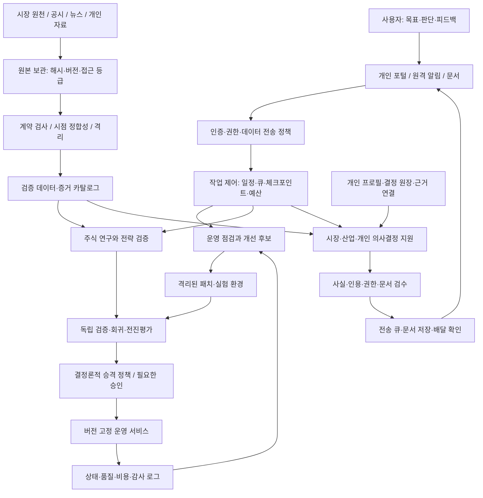

# 개인 AI 운영체계 아키텍처 및 구현 핸드오프

작성일: 2026-09-12 / 작성: Codex / 대상: 소유자, Gemini·Claude 등 후속 구현 담당자

**문서 상태: 설계 제안. 시스템 변경·실행을 승인하거나 구현을 완료한 문서가 아니다.** 이번 작업에서는 소스와 기존 산출물을 읽고 외부 공개 자료를 참고했다. 서비스 실행·재시작, DB 질의·보정, 백테스트, 모델 호출을 통한 시스템 가동, 자동화 등록, 외부 리포트 전송은 하지 않았다. 새로 작성한 것은 이 핸드오프 문서다.

## 1. 권고 결론과 목표

현재 자산을 유지하면서 **검증 가능한 개인 AI 운영체계**로 발전시키는 것이 적절하다. stock_dashboard를 금융 데이터·전략 연구의 중심으로, CEO Briefing/Market Intelligence를 시장·산업·개인 의사결정의 중심으로 유지한다. Antigravity는 두 영역을 연결하는 작업 제어 계층으로 재정비한다.

우선순위는 ① 실제 상태와 화면 상태의 일치 ② 데이터의 원천·단위·가용시점 검증 ③ 매수·매도·원장 검증 ④ 개인 지식 및 판단 기억 ⑤ 제한된 자율 개선이다. 기존 운영 DB를 새 에이전트 DB로 한꺼번에 옮기거나 모든 코드를 재작성하지 않는다.

AGI·ASI는 장기 비전을 설명하는 표현으로만 사용한다. 이 설계로 일반지능·초지능을 달성하거나 수익이 지속 상승한다고 보장할 수 없다. 구현 가능한 목표는 **여러 분야의 정보를 연결하고, 사용자의 판단 기준을 기억하며, 증거와 평가에 따라 역량을 점진적으로 넓히는 시스템**이다. 개선은 매일 코드나 전략을 바꾸는 것이 아니라, 매일 재평가하고 검증을 통과한 변화만 채택하는 것이다.

| 사용자 요구 | 설계 대응 | 완료를 판단할 증거 |
|---|---|---|
| 현재 시스템을 이해하고 개선 | 실행 경로·DB·수집·API·화면 의존성 목록 | 실제 배포본과 일치하는 서비스 manifest |
| 매일 자율 점검·개선 | 영속 작업 큐, 품질 사고 목록, 개선 후보, 검증·배포 게이트 | 매일 run 기록과 완료/보류 사유 |
| 주식 데이터 무결성 | 데이터 계약, 원천 보존, 시점별 버전, 격리, 교차검증 | 데이터셋·기간·종목별 검사 결과와 예외 |
| 종료될 때까지 전략 검증 | 장기 연구 캠페인과 유한 실행 단위 | 모든 실험·기각·전진검증 기록 |
| 나의 지식·주요 결정 지원 | 개인 프로필, 지식 검색, 결정 원장, 결과 피드백 | 인용 가능한 답변과 사후 평가 |
| 모든 정보를 수용 | 분류별 저장·접근·모델 전송 정책 | 접근 차단 및 삭제 전파 테스트 |
| 원격·자동 리포트·문서 | 인증된 모바일 화면, 전송 큐, 문서 렌더링 | 배달 영수증·문서 버전·출처 |

## 2. 조사 범위와 현재 구성

### 2.1 확인한 위치

| 영역 | 확인 위치 | 해석 |
|---|---|---|
| 통합 저장소 | `/Volumes/Realtek_NVME/AI System` | README, 실행 스크립트, Antigravity, CEO 코드 존재 |
| 주식 런타임 소스 | `/Volumes/Realtek_NVME/stock_dashboard/runtime` | 현재 검토 기준 소스. 실행 중 프로세스의 경로와 동일한지는 미검증 |
| 주식 별도 소스·문서 | `/Volumes/Realtek_NVME/stock_dashboard` | runtime 외에도 같은 이름의 소스와 문서 존재. 배포본 혼동 가능 |
| 예전 주식 경로 | `/Applications/stock_dashboard` | 이번 환경에서는 해당 경로를 찾지 못함. 예전 문서의 링크 설명을 그대로 믿으면 안 됨 |
| Market Intelligence | `AI System/codex/ceo-briefing-platform` + stock `routes/global_macro.py` | 뉴스·일정·경제통계·주식 매크로의 결합으로 해석. 소유자가 부르는 범위와 최종 일치 여부는 착수 때 확인 |

`codex/AGENTS.md`는 예전 Downloads 경로와 SQLite를 기술하지만, stock의 2026-09-12 저장 감사에는 주 DB가 PostgreSQL로 표시된다. Antigravity quant worker는 여전히 SQLite `stock.db`를 직접 읽는다. **운영의 단일 기준 DB, 미러의 목적, 데이터 갱신 경로를 먼저 확정해야 한다.** 현재 DB를 직접 조회하지 않았으므로 동기화 장애를 확정한 것은 아니다.

이번 문서는 정적 코드 검토와 이미 저장된 감사 산출물 검토다. 전체 서비스·전 테이블·전 전략의 무결성을 인증하지 않는다. 기존 보고서 수치는 당시 실행 결과이며 이번 작업의 재측정값이 아니다. 개인 파일·비밀키 내용은 조사 대상으로 삼지 않았다.

### 2.2 유지할 자산

- stock의 수집기, `canonical_financial_data`, `canonical_cashflow_data`, 데이터 수정 로그, 가용시점 관련 규칙, 페이지별 품질 감사, 일일·월간·분기 검사.
- 전략 원장·결정론 검증·수정 핸드오프·실험 산출물. 이들은 새 연구 루프의 출발점이다.
- CEO Briefing의 뉴스 수집·분류·요약, 일정, Telegram 관련 기존 코드, 글로벌 매크로 프록시.
- Antigravity의 개발/콘텐츠 책임 분리, 관제 화면, 메모리 스키마 초안. 다만 역할 명칭과 실제 기능 수준은 재정의한다.

## 3. 우선 수정 또는 재검증할 사항

P0는 기능 확장·자율 권한 확대 전에 처리할 항목이다. 아래에서 “확인”은 명시한 코드 경로에 한정한다. 공개 인터넷에서 공격 가능하다거나 실제 자금 손실이 발생했다고 주장하지 않는다.

| ID | 우선순위·상태 | 근거와 문제 | 후속 조치·수락 기준 |
|---|---|---|---|
| A01 | P0·소스 확인 | `process_watchdog.py:get_system_status()`가 `clean_redundant_ports()`를 호출해 8502/5174/8012 점유 PID에 `kill -9` 실행. bridge 자체도 8502 사용 | 조회와 복구 분리. GET/상태 조회에서 프로세스·파일·DB 변경 0건. 소유한 서비스의 PID·실행 파일·시작 시각 확인 없이 종료 금지 |
| A02 | P0·소스 확인 | `codex_builder.generate_patch()`는 주석을 생성. `self_healing_loop()`는 리뷰 승인만으로 `is_auto_merged=True`. 실제 테스트·Git merge 증거 없음 | 제안/적용/검증/배포 상태 분리. 빈 diff·주석뿐인 패치로 결함 해결 처리 불가. commit·테스트·재현 통과·배포 확인 필요 |
| A03 | P0·소스 확인 | quant worker의 ECOS·컨센서스는 고정값, DB 부재 시 샘플 종목·가격, 비중은 균등. `execute_order()`는 외부 주문 없이 FILLED 기록 | fixture를 별도 demo 모드로 격리. 운영은 missing/degraded, 주문은 실행 증거 없으면 체결 금지. `is_mock=False`만으로 실전 상태 표기 금지 |
| A04 | P0·소스 확인 | PM의 키워드 판정에서 일반 질문도 리밸런싱 작업으로 이어질 수 있음. Dev 루프는 BUY만 수행하고 최소 1주를 강제 | 읽기/분석/제안/주문 의도 분리. 분석 요청에서 주문 호출 0회. 현금·비용·위험 예산 부족 시 0주 |
| A05 | P0·소스 확인, 배포 경계 미확인 | bridge trigger에 앱 내 인증 검증이 보이지 않음. CEO `require_admin()`은 전달된 role 문자열만 비교 | 서버 검증 세션/토큰에서 권한 결정. `role=admin`만 주는 요청 거부. 외부 프록시 인증과 내부 API 인증을 함께 확인 |
| A06 | P1·소스 확인 | content orchestrator는 Slack/Notion 전송을 시뮬레이션하고 성공 플래그 설정 | prepared/queued/sent/failed 구분. 제공자 메시지 ID와 확인 응답 없으면 sent 금지. CEO의 별도 Telegram 코드는 이 판정과 구분 |
| A07 | P1·소스 확인 | 벡터 실패 시 `hash(text)` 기반 난수 벡터 사용. 의미 임베딩이 아니며 프로세스 간 안정성도 보장되지 않음. DB 실패 시 메모리는 휘발성 | 검색을 명시적으로 degraded 처리하고 키워드 검색으로 전환. 원문 영속 보존. 모델/차원별 인덱스 분리, 재시작 검색 일관성 검증 |
| A08 | P1·소스 확인 | PM의 tasks, 주문, 보고 등 핵심 상태가 리스트에 저장되는 경로 존재. 메모리 DDL의 존재가 실제 저장 증거는 아님 | 작업·실험·전송 원장을 영속화. 재시작 후 중복 실행/전송 없이 이어짐 |
| A09 | P1·소스 확인 | 통합 시작 스크립트는 포트 기준 강제 종료 후 nohup 실행. stock 운영 지침은 launchd 중복·고아 프로세스 사고를 경고 | 서비스 관리자 단일화. 서비스별 시작·중지·복구 계약, 준비 상태 검증, 외장 SSD 미탑재 시 쓰기 중지 |
| A10 | P1·연동 위험 | 운영 stock과 Antigravity의 DB·경로·스키마 기준 차이 | 운영 데이터 adapter를 통해 같은 snapshot ID/기준시각 확인. 오래된 미러를 최신으로 표시 금지 |

### 3.1 stock 데이터: 새 검사를 만들기 전 기존 검사의 의미를 바로잡기

2026-09-12 06:20 저장 [무결성 보고서](/Volumes/Realtek_NVME/stock_dashboard/runtime/research_outputs/data_integrity_daily/integrity_20260912_062007.txt)는 10개 검사 중 2개 유형을 이슈로 표시한다. 매출 YoY 극단 변화와 영업이익/매출 관계가 예시다. **원문 대조 전 오류 확정·자동 축소·자동 삭제를 하면 안 된다.** 특히 지주회사·업종·회계 계정 정의 때문에 단순 부등식이 부적절할 수 있다. 검사 규칙의 오탐도 개선 대상이다.

동일 보고서에서 최근 재무 없음 전체 219종목, EPS 괴리 전체 10건이 표시되지만 체크는 통과다. 이는 현재 검사 정책·예외 범위의 통과이지 결측과 괴리가 0이라는 의미가 아니다. 화면에는 검사 상태와 미검증 건수·분모·제외 사유를 따로 표시한다.

[06:41 페이지 감사](/Volumes/Realtek_NVME/stock_dashboard/runtime/research_outputs/all_page_data_quality_20260912.md)는 OK 31 / 수집필요 1 / 검토필요 2 / 누락 0을 기록한다. 희석 이벤트 미분류 197, 텐버거 중복 grain 117, 주요 퀀트 지표 stale 5>2가 남아 있다. 기간 끝이 2031년인 지표도 있으므로 예측·일정과 관측 실적을 구분해야 한다. 미래 날짜 자체를 오류로 단정하지 않는다.

`ok_with_fallback`은 대체 테이블이 있다는 의미만으로 완전 통과시키지 않는다. 실제 API·전략이 그 fallback을 사용하고, 시간 범위·종목·단위·시점이 맞는지 소비 경로까지 확인한다. 페이지에 현재 시가총액을 보완하는 방식은 과거 전략에서 당시 시가총액을 복원한 것과 다르다.

stock scheduler에는 이미 06:20 보정 후 검사, 월간·분기 검사와 후속 검증이 있다. 새 일일 스케줄러를 중복 등록하지 말고 이 결과를 통합 제어 계층에 연결한다. 자동 보정 전/후 증거·승인된 규칙 버전·영향 범위를 확보한다.

### 3.2 stock 전략: 과거 결함과 현재 상태 분리

기존 [전략 코드 핸드오프](/Volumes/Realtek_NVME/stock_dashboard/docs/claude_handoff_strategy_code_findings_20260912.md)의 F01~F09는 중요한 회귀검사 목록이다. 다만 이번에 본 runtime에는 `marks_preopen`, `hard_cap`, `buy/pyramid_add` 분기, 시가 결측 처리 수정 흔적이 있다. 따라서 과거 문서의 모든 결함을 현재 미수정으로 재선언하지 않는다.

후속 담당자는 F01~F09 각각을 **미수정 / 수정됨·미검증 / 회귀 통과 / 전진검증 통과**로 분류한다. 이번 작업은 수정의 완전성, 운영 반영, 수익률 영향을 검증하지 않았다. 기존 높은 수익률 수치를 아키텍처의 성과 근거로 사용하지 않는다.

## 4. 목표 아키텍처

### 4.1 책임과 구현 선택

| 계층 | 권고 | 중요한 경계 |
|---|---|---|
| 운영 데이터 | 기존 stock PostgreSQL·보조 SQLite·CEO DB 유지, 읽기 adapter부터 구축 | 데이터셋별 단일 쓰기 소유자 지정. 새 데이터 복제보다 기존 검증 데이터 재사용 |
| 원본·대용량 산출물 | 외장 SSD의 버전별 파일·Parquet·원문 + 해시 manifest | 원본 append-only. DB에는 위치·해시·정책·상태 저장 |
| 작업 제어 | Python 서비스 + PostgreSQL 작업 원장·lease·중복 키; 필요한 AI 단계에 LangGraph 체크포인트 적용 검토 | 단일 Mac에는 대형 분산 플랫폼부터 도입하지 않음. 큐의 기준 상태와 그래프 체크포인트의 관계 명시 |
| 분석 | 수치 계산은 기존 Python/SQL, 시점 고정 snapshot 활용 | LLM이 직접 수익률·회계 수치를 생성해 사실로 저장하지 않음 |
| 지식 검색 | 권한 필터가 있는 키워드+실제 벡터 검색, 출처 재정렬 | GraphRAG는 복잡한 관계 질문에서 측정된 개선이 있을 때 확장 |
| 모델 경로 | 작업별 품질·비용·개인정보 등급에 따른 provider adapter | 구체 모델명은 착수 시 가용성 확인. 모델 변경도 평가 대상 |
| 실행·감시 | 기존 launchd 관리 체계와 통합, 연구 worker 수 제한 | 운영 웹 요청 안에서 무거운 백테스트·자가 패치 실행 금지 |
| 표시·전송 | 기존 웹 화면에 신뢰 상태·실험·승인·문서 연결 | 사용자에게 보내는 문서는 문서 상태와 데이터 기준시각을 먼저 표시 |

개발·검증·리스크·콘텐츠는 논리적 역할이다. 처음부터 각각 별도 상주 프로세스나 서로 다른 유료 모델일 필요는 없다. 제안자가 평가 기준과 승인 정책을 동시에 바꾸지 못하게 하는 것이 핵심이다. 모델 간 다수결은 사실 검증을 대체하지 않는다.

### 4.2 최소 영속 계약

아래는 새 테이블을 무조건 추가하라는 DDL이 아니라 논리적 계약이다. 기존 테이블과 중복 여부를 확인해 확장·매핑한다.

| 계약 | 최소 필드 |
|---|---|
| service_manifest | service_id, 실제 source_root, entrypoint, DB alias, owner, 실행 관리자, 데이터 볼륨, health 계약, deployed_commit |
| source_record | source_id, 원문 URI, content_hash, 수집시각, 발표시각, 적용기간, version, 접근등급, 라이선스/보존 정책 |
| dataset_snapshot | snapshot_id, 테이블·기간·종목 범위, 원천 지문, 변환 코드, 계약 버전, 품질 상태 |
| quality_issue | issue_id, rule_id/version, dataset/snapshot, 영향 범위, 원문 근거, 심각도, 상태, 보정 전후, run_id |
| task_run | run_id, parent/campaign, input_hash, idempotency_key, 상태, lease, retry_count, checkpoint, budget, 결과 링크 |
| experiment_run | hypothesis_id, 사전 등록 spec, code/data/model/prompt 버전, 탐색 이력, 평가 구간, 비용, 원장·결과 지문 |
| decision_record | 질문, 당시 증거, 선택지, 사용자 판단, 예상 결과·확률·기한, 반증 조건, 실제 결과, 학습 내용 |
| policy_version | 허용 도구·경로·행동·수신자·비용, 효력시각, 작성/승인자, 만료/폐기 |
| artifact_delivery | 문서 버전/해시, 수신자, 접근등급, delivery_key, queued/sent/failed/unknown, 제공자 ID, 재시도 |

공통으로 created_at, updated_at, trace_id를 둔다. 사건 기록·수정 이력은 삭제/덮어쓰기 대신 새 버전과 supersedes 관계로 연결한다. 접근권한과 보존 정책에 따른 삭제는 별도 절차로 처리한다. 비밀키는 이 계약의 JSON이나 로그에 넣지 않는다.

### 4.3 장기 실행과 재시작

상태는 `PENDING → RUNNING → SUCCEEDED | FAILED | BLOCKED | CANCELLED`로 관리하고, 승인 대기는 `WAITING_APPROVAL`로 구분한다. 각 실행에 마감, 최대 시도, 최대 모델 호출, 비용 상한을 둔다. 무한 while 루프 하나로 “평생 개선”을 구현하지 않는다.

캠페인은 사용자가 종료할 때까지 활성 상태로 남고, 매일/사건마다 제한된 작업을 생성한다. 재시작 시 lease가 만료된 작업을 복구하며 이미 완료한 단계는 결과를 재사용한다. 외부 전송은 재호출이 중복될 수 있으므로 outbox와 중복 키를 사용한다. 응답 유실 시 무조건 재발송하지 않고 unknown 상태에서 제공자 결과를 조회한다. DB와 외부 서비스 사이의 완전한 exactly-once를 가정하지 않는다.

## 5. 주식 데이터 무결성 체계

### 5.1 데이터 계약과 시점

행의 의미를 먼저 고정한다. 예를 들어 재무는 `entity_id + 회계기간 + CFS/OFS + 보고서 종류 + 계정 표준키 + 공시 버전`을 구분한다. 종목코드만으로 회사·시장·통화·종류주를 식별하지 않는다. 코드 변경·합병·분할·상장폐지 이력은 security master로 관리한다.

모든 시계열에 다음을 구분한다.

- **관측·회계기간:** 어느 기간의 값인가.
- **발표시각:** 원천에서 언제 공개했는가.
- **수집시각:** 우리 시스템이 언제 받았는가.
- **사용 가능시각:** 해당 전략이 어떤 지연·시장시간 조건에서 사용할 수 있었는가.
- **정정·빈티지:** 당시 버전과 현재 최종값이 다른가.

과거 시점 재현은 원천의 실제 발표/정정 이력과 선언한 수집 지연을 사용한다. 실시간 운영 재현은 실제 수집시각까지 반영한다. 지금 받은 과거 자료를 당시 실제로 수집한 자료라고 표시하지 않는다. 정확한 가용시점이 없으면 `PIT_APPROX` 또는 `PIT_UNKNOWN`으로 제한한다. FRED는 최신 관측치와 과거 시점에 알려진 값을 구분하는 real-time period를 제공한다. [FRED 원문](https://fred.stlouisfed.org/docs/api/fred/realtime_period.html)

### 5.2 검사 계층

| 계층 | 검사 예 | 실패 처리 |
|---|---|---|
| 수집 | 응답상태·스키마·행수 급변·요청범위·원문 해시 | 원문 저장 후 격리, 이전 정상본의 기준시각 표시 |
| 구조 | 자연키 중복·참조키·자료형·시장/통화/단위 | 운영 사용 차단, 중복 후보와 원인 기록 |
| 의미 | OHLC 순서, 음수 거래량, 원/천원/백만원/억원, CFS/OFS, 누적/단일분기 | 자동 단위 추측 보정 금지, 원천 근거로만 규칙 적용 |
| 회계 | 자산=부채+자본, 현금 증감 조정, 기간 일치, EPS 주식수 정의 | 업종·회계기준별 허용오차/예외. FCF와 재무활동 현금흐름 명칭 혼동 방지 |
| 시간 | 거래일/휴장·발표일·정정·상장상태·수정주가 | 누락과 거래정지 구분. 알려지지 않은 값의 과거 신호 사용 차단 |
| 교차원천 | 공시 원문과 표준 재무, 시세 공급자 차이 | 권위·지연·조정 정책 차이를 먼저 해소. 다수결로 확정 금지 |
| 소비 | DB→API→화면 단위·날짜, 전략이 읽는 테이블·fallback | 해당 소비 경로만 degraded/blocked, 대체 데이터의 식별자 노출 |

수정주가와 원주가, 배당 포함 총수익을 명시적으로 구분한다. 분할·배당·권리락 조정 계수를 검증하고, 미래에 정정된 계수로 역사 데이터를 갱신한 경우 snapshot 버전을 바꾼다. 거래량·시가총액·유통주식수도 같은 기준일로 연결한다.

### 5.3 품질 판정과 보정

단일 “99점”보다 `PASS / WARN / QUARANTINED / STALE / UNKNOWN`과 세부 차원을 제공한다. 커버리지 분모는 시장·상장상태·기간·데이터의 적용 가능성별로 명시한다. 모든 종목에 모든 항목이 필수인 것처럼 계산하지 않는다.

보정 절차는 **이슈 → 원문 재확인 → 수정 후보 diff → 계약 검사 → 승인된 규칙 범위 적용 → 소비 결과 재검증**이다. AI는 매핑 후보를 제안하고 결정론적 규칙이 승인 여부를 판단한다. 기존 `financial_fix_log`, `cashflow_fix_log`, `data_fix_log`를 활용한다. 원문과 보정 전 값을 보존하며, 백업 복구·역변경 경로를 마련한다.

단위 오류를 의심해 10,000이나 100,000,000으로 자동 나누는 행위를 금지한다. 검사 실패를 숨기려고 threshold를 넓히는 변경도 별도 평가·승인 대상으로 둔다. 같은 규칙의 경고가 반복되면 경고 제거보다 미해결 기간·영향 전략·오탐 여부를 추적한다.

### 5.4 무결성 수락 기준

초기 제안 기준이며 실제 데이터 계약을 정의한 뒤 고정한다.

- 운영 승격에 필요한 자연키 중복·단위 미확정·미래정보 위반 **0건**. 예외를 허용하려면 사용 범위·종료일을 명시한다.
- 주요 표시값과 전략 입력은 원문/변환/snapshot까지 추적 가능해야 한다.
- 보유 및 연구 유니버스의 필수 일별 입력은 거래 캘린더 기준으로 확인한다. 결측 종목은 조용히 제외하지 않고 제외 비율과 편향을 보고한다.
- 미래 공시·가격을 바꿔도 이전 의사결정 결과는 변하지 않아야 한다.
- 정정 공시는 이전 버전을 보존하고 정정 이후에만 새 정보가 사용된다.
- 날짜·종목·단위별 위험 표본을 사람의 원문 대조 대상으로 남긴다. 자동 검사가 모든 의미 오류를 탐지한다고 선언하지 않는다.

## 6. 매수·매도 전략의 지속 검증과 개선

### 6.1 공통 신호와 서로 다른 실행 환경

전략을 `signal(snapshot, as_of, parameters)`와 `portfolio_step(account_state, signals, execution_contract)`로 분리한다. 백테스트·모의·실전이 같은 신호와 포트폴리오 규칙을 쓰되, 체결 adapter만 다르게 한다. 과거 백테스트의 체결 목록을 오늘의 신규 신호로 재생하지 않는다.

전략별 입력 계약에는 시장·유니버스·워밍업·공시 가용시점·리밸런싱 시각·체결가격·결측 처리·비용·세금·호가/유동성·종목/섹터/총액 한도를 포함한다. 해당 시장의 최신 거래 규칙·비용은 구현 때 공식 자료로 확인해 버전 고정한다.

매도 검증은 매수만큼 독립적으로 수행한다. 손절, 추적손절, 부분매도, 추가매수, 익절 후 재진입, 거래정지, 갭 하락, 순위 탈락 후 보유 관리, 여러 전략의 동일 종목 소유·청산 충돌을 포함한다. 신규 후보가 0개여도 기존 보유의 위험 관리는 계속되어야 한다.

### 6.2 연구 캠페인

1. 기존 F01~F09 상태를 재확인하고 수정 후 기준선을 만든다.
2. “왜 개선될 것인가, 어떤 실패가 가설을 반증하는가”를 실험 전에 등록한다.
3. code/data/spec를 고정하고 같은 자본·기간·비용 조건으로 기준선과 비교한다.
4. 시간 순서 기반 walk-forward를 사용한다. 라벨·보유기간이 겹치는 경우 purge/embargo를 적용한다.
5. 전략·파라미터·유니버스·매도 규칙을 몇 번 탐색했는지 전부 기록한다. 이미 반복 탐색한 구간을 새 OOS라고 부르지 않는다.
6. 탐색 담당자가 반복 열람할 수 없는 holdout과 실제 미래 paper 기간을 구분한다. holdout을 공개했다면 그 사용 사실을 기록하고 이후 미래 기간을 축적한다.
7. 비용·슬리피지·시장충격·유동성 제약을 반영하고, 비용 1.5배/2배 등 사전 정의한 스트레스도 비교한다.
8. candidate→validated→shadow/paper→eligible 순으로 이동한다. 성과가 약하거나 근거가 부족하면 기존 전략 유지 또는 거래 보류가 정상 결과다.

여러 전략을 시도한 뒤 가장 좋은 결과만 택하면 백테스트 과적합 위험이 커진다. PBO와 선택편향을 고려하는 지표는 연구의 보조 검증으로 사용하되 미래 성과를 보장하는 인증서로 사용하지 않는다. [Bailey 외, The Probability of Backtest Overfitting](https://www.davidhbailey.com/dhbpapers/backtest-prob.pdf)

### 6.3 평가 지표와 승격

수익률 하나로 선택하지 않는다. 동일 기간 벤치마크·기존 운영 전략 대비 비용 차감 수익, CAGR, MDD, 회복기간, 변동성, 하방위험, 회전율, 종목/섹터 집중, 거래 수, 유동성 수용량, 구간별 일관성, 민감도와 신뢰구간을 제출한다. 짧은 구간의 CAGR·Sharpe는 불확실성을 함께 표시한다.

승격 필수 조건은 데이터 계약 통과, 미래정보 회귀 통과, 원장 일치, 중복 실행 방지, 허용 위험 상한 준수, 검증 구간·탐색 이력 공개다. **허용 MDD·종목 최대 비중·총 투자금·시장/자산 범위는 소유자가 정하기 전 미설정 상태**다. 시스템이 임의 숫자를 운영 한도로 채우지 않는다. paper 기간은 최소 달력 일수뿐 아니라 실제 거래 횟수와 관측 시장 국면의 충분성을 요구한다.

연구 반복은 지속하지만 운영 전략을 매일 교체하지 않는다. 연구 결과에 따른 후보 승격 심사는 주간 또는 충분한 새 증거가 생긴 시점에 진행한다. 심각한 데이터·원장·위험 위반은 즉시 신규 위험 확대를 차단하고 기존 보유 처리 정책을 따로 적용한다.

### 6.4 필수 회귀 사례

| 사례 | 예상 결과 |
|---|---|
| 미래 연간 실적·정정값만 변경 | 과거 신호 불변 |
| 시가 이전 입력 동일, 당일 종가만 변경 | 시가 주문 수량·허용 여부 불변 |
| 전략 hard cap 500만원, 목표 티켓 2,500만원 | 비용 포함 지출 500만원 이하 |
| 매수→추가매수→부분매도 | 원장 합계와 실제 현금·보유 일치 |
| 시가 NULL/0·거래정지·과거 가격만 존재 | 허구 체결 없음, 평가와 실행 가격 분리 |
| 후보 0개·순위 탈락 계좌 | 기존 보유 위험 관리 지속 |
| 같은 run 재시도·프로세스 재시작 | 중복 주문·중복 원장 없음 |
| 같은 초기 계좌와 일별 입력의 backtest/paper | 계약상 같은 신호·주문·원장; 차이가 있으면 원인 기록 |
| 배당·분할·상장폐지 | 현금/수량/가격 조정 일관, 생존 종목만 비교하지 않음 |

실전 주문 연결은 별도 프로젝트 단계다. 현재 Antigravity의 FILLED 레코드는 실제 증권사 체결 증거가 아니다. 실전 단계에서는 주문 접수/부분체결/취소/거부/미확인·잔고 대사·중복키·통신 복구·소유자 중지 수단이 필요하다. 이번 문서는 실전 거래를 승인하지 않는다.

## 7. Market Intelligence와 개인 판단 체계

### 7.1 “나처럼 생각한다”의 구현 정의

사용자의 말투만 모방하는 것보다 **사용자가 무엇을 중요하게 생각하고 어떤 근거로 결정을 바꾸는지**를 구조화한다. 현재 요청만으로 사용자의 모든 가치관·투자 성향·회사 권한을 추정하지 않는다.

| 기억 종류 | 저장 내용 | 갱신 방식 |
|---|---|---|
| 명시 프로필 | 목표, 역할, 관심 산업, 시간 범위, 선호 보고 형식 | 사용자 확인된 값만 확정 |
| 판단 기준 | 위험·기회·실행가능성의 우선순위, 필요한 증거 수준 | 버전·효력시각·적용 업무 기록 |
| 사실 지식 | 문서·회의·산업 구조·기업·사업·일정 | 원문과 출처를 연결; 최신 사실과 과거 사실 분리 |
| 결정 이력 | 당시 질문·선택지·근거·선택·기대 결과 | 결과 확인일에 평가. 사후 정보를 당시 판단에 섞지 않음 |
| 추정 선호 | 반복 관찰한 선호 후보 | 확정 프로필과 구분하고 확인 또는 폐기 |
| 반증·실패 | 틀린 예측, 놓친 위험, 바뀐 전제 | 사례 기반 검색과 평가 문제로 재사용 |

순응만 잘하는 시스템은 주요 결정 지원에 부족하다. 사용자의 판단 기준을 존중하면서 반대 근거, 대안, 불확실성, 결정을 보류할 조건을 제시한다. “이해한 사용자 기준”과 “이번 분석에서 나온 판단”을 구분한다.

### 7.2 정보→주장→결정 파이프라인

원문 수집 → 출처 등급·권한 확인 → 기업/인물/제품/국가/프로그램/날짜 연결 → 사건 중복 군집 → 검증 가능한 주장 추출 → 지지·반박 근거 연결 → 사용자 목표와의 관련성 판단 → 선택지 비교 → 문서 생성 → 결과 추적.

주장에는 `claim, source_span, publication_time, event_time, certainty, supporting_sources, contradicting_sources`를 저장한다. 동일 보도자료를 옮긴 10개 기사는 독립된 10개 확인으로 세지 않는다. 기사 요약·기업 주장·확정 공시·분석 추정을 구분한다. 정정 기사와 번복은 삭제하지 않고 연결한다.

KAI/항공방산은 현재 코드의 주요 도메인이므로 초기 특화 분야로 삼을 수 있다. 기업→사업/플랫폼→계약→고객국가→예산/조달→경쟁사→공급망을 연결한다. 다른 개인 업무 영역으로 확장할 때도 같은 증거 계약을 사용한다. 분류체계를 사용자의 실제 업무 권한과 제공 자료에 맞게 확정한다.

모든 문서를 한 번에 거대한 프롬프트에 넣지 않는다. 질문·사용자 권한·업무 목적에 맞는 자료를 검색해 필요한 부분만 모델에 전달한다. 검색 품질이 입증된 후 관계 그래프를 확장한다. Microsoft GraphRAG의 문서 관계 기반 접근은 복수 문서의 전반적 연결 질문을 위한 참고 사례다. [GraphRAG 공식 문서](https://microsoft.github.io/graphrag/)

### 7.3 개인화 평가

사용자가 선택한 실제 질문·과거 결정 사례로 소규모 평가세트를 만든다. 초안으로 30~50개 사례를 제안하며, 정답은 과거 결정을 무조건 따라 하는 것이 아니라 당시 자료로 타당한 이유를 설명하는 것이다. 개발용과 비공개 평가용을 분리한다.

평가 항목: 인용 정확성, 핵심 정보 누락, 사용자 기준 반영, 적절한 반대 의견, 불확실성 표현, 다음 행동의 실행 가능성, 문서 수정량, 실제 도움 정도. 예측은 사건·기한·확률을 명시한 경우에만 Brier score 같은 사후 지표로 평가한다. 단순 만족도만으로 사실 정확성을 대신하지 않는다.

## 8. 모든 개인 데이터를 수용하는 저장·접근 설계

“모든 정보를 넣는다”는 목표는 모든 모델과 에이전트가 모든 정보를 읽는다는 뜻으로 구현하지 않는다. 개인·업무·금융·민감 자료를 논리적으로 분리하고, 인덱스·캐시·생성 문서에도 원문 권한을 전파한다.

| 등급 | 예 | 기본 처리 제안 |
|---|---|---|
| 공개 | 공시, 공개 통계, 공개 뉴스 | 출처·사용 조건에 맞춰 검색·요약 |
| 개인 | 개인 메모·일정·연락처 | 본인 인증 후 검색. 외부 모델 전송은 등록 정책에 따른 최소 정보 |
| 업무 제한 | 사내 문서·계약·비공개 회의 | 조직 정책·문서 권한 우선, 허용되지 않은 외부 모델 전송 차단 |
| 고도 민감 | 계정 복구 정보·비밀키·신분/금융 식별 정보 | 비밀 저장소로 분리. 검색 임베딩·일반 로그·보고 본문에서 제외 |

문서 ingest는 원본 해시·OCR/추출 버전·소유자·보존기간·권한을 기록하고, 중복 입력은 같은 원본 계보로 묶는다. 삭제 요청은 원문·검색 인덱스·캐시·파생 문서·백업 보존 정책까지 추적한다. 백업 복원 시 삭제 tombstone을 재적용한다.

외부 문서에 들어 있는 “시스템 지시”, 코드, 링크는 자료일 뿐 실행 권한이 아니다. 인용 근거를 읽는 역할에 임의 셸·비밀키·전송 권한을 주지 않는다. 도구 실행은 사용자 의도·정책·허용 대상·입력 검증을 거친다. CORS 설정은 인증을 대신하지 않는다.

저장 볼륨·백업 암호화, macOS Keychain 등 비밀 관리, 서비스별 최소 권한, 사용자 세션 만료·폐기, 원격 접근 이력, 데이터 외부 전송 기록을 구현한다. 백업은 동일 SSD 한 곳에만 두지 않는다. 실제 Mac RAM·남은 저장공간·백업 매체·복구 환경은 이번에 측정하지 않았으므로 다음 단계에서 확인한다.

## 9. 자율 개선의 허용 범위와 검증

### 9.1 권한 단계

아래는 **장래 운영 정책 제안**이며 현재 작업에 실행 권한을 추가하지 않는다.

| 수준 | 자동 허용 대상 | 필요한 조건 |
|---|---|---|
| L0 관찰 | 상태·로그·품질 결과 읽기, 개선 후보 작성 | 읽기 경로의 부작용 제거 |
| L1 연구 | 격리 환경 패치, fixture 검사, 고정 데이터 실험, 문서 초안 | 시간·비용·파일·네트워크 범위 제한 |
| L2 제한 복구 | 사전 등록된 재시도·캐시 재생성·허용 서비스 복구 | 정확한 runbook, 횟수 제한, 복구 검증·되돌리기 |
| L3 제한 배포 | 낮은 위험의 검증된 변경 | 소유자가 미리 승인한 범위, 회귀·관측 기간·자동 롤백 |
| 별도 승인 | 전략 운영 교체, 실제 주문, 대규모 DB 수정, 데이터 외부 공유, 권한 확대 | 구체 변경·영향·복구안을 검토한 승인 |

정책 파일, 승인 로직, 평가 정답, 데이터 격리 규칙, 거래 위험 상한을 에이전트가 자기 편의로 고칠 수 없게 한다. 같은 문제에 대한 패치 시도는 초기 최대 3회, 동일 실패 반복 시 BLOCKED로 전환해 원인을 보고한다. 한도의 구체 값은 운영 관찰 후 조정한다.

### 9.2 개선 루프

`문제 감지 → 영향도/재현 자료 → 최소 변경 제안 → 격리 구현 → 회귀·보안·데이터 계약 검사 → 독립 검토 → 승인 정책 → 제한 배포 → 사후 관측 → 완료/롤백`

다른 모델이 승인했다는 사실만으로 완료하지 않는다. 실제 diff, 실패 재현, 수정 후 통과, 영향 범위, 운영 건강 상태가 필요하다. 테스트를 지우거나 기준을 약하게 바꾼 패치는 별도 검토한다. 운영 자료에서 나온 새 실패는 회귀 사례로 축적한다.

LLM이 스스로 제안하고 평가하는 구조는 명확한 평가 기준이 있을 때 유용하다. Anthropic의 workflow·evaluator-optimizer 패턴은 책임 분리의 참고이며, 이 문서의 승격 정책은 개인 시스템에 맞춘 제안이다. [Anthropic 설계 패턴](https://www.anthropic.com/engineering/building-effective-agents)

## 10. 일일 운영·원격 리포트·문서

### 10.1 권고 일정

모두 Asia/Seoul 표시 기준의 제안이다. 고정 시각만 믿지 않고 원천 데이터 도착·거래 캘린더·미국 서머타임을 반영한다. 주말에도 운영 점검·지식 정리는 가능하며 휴장일의 시세 부재를 장애로 처리하지 않는다.

| 주기/시점 | 작업 | 결과 |
|---|---|---|
| 5~15분 | 서비스 준비 상태·최근 성공 run·데이터 볼륨·큐 적체 | 상태 변화나 장애 시에만 즉시 알림 |
| 기존 새벽 검사 완료 후 | stock 감사 결과 수집·원문 대조 큐·전략 영향 연결 | 데이터 신뢰 보고, 신규 위험 확대 허용 여부 |
| 07:30 제안 | 미국장 데이터 도착 확인 후 아침 브리핑 | 중요한 변화, 나의 관심사 영향, 결정 필요 항목 |
| 한국장 종료 후 데이터 확정 시 | 신호·계좌/원장·위험·전진검증 | 체결 계약에 맞는 다음 단계. 종가 미확정이면 보류 |
| 20:30 제안 | 일일 종합·문서·미완료 결정 | 주요 변화·미해결·내일 볼 조건 |
| 유휴 시간 | 제한된 전략 실험·패치 후보 평가 | 검증 결과와 후보만 생성 |
| 주간 | 전략 후보·품질 규칙·개인화 성능 검토 | 채택/기각/추가검증 결정 |
| 월간 | 백업 복원·권한·모델/비용·운영 정책 점검 | 복구 실증과 정책 수정 제안 |

### 10.2 리포트 형식

아침/저녁 브리핑 첫 화면은 ① 오늘 중요한 변화 ② 나의 의사결정 영향 ③ 필요한 행동과 기한 ④ 반대 근거·불확실성 ⑤ 데이터 기준시각·미검증 항목을 담는다. 원문과 상세 검증은 클릭해서 확인한다.

주식 보고는 추천 신호, 실제 주문 의도, 모의 결과, 실제 체결을 명확히 구분한다. 데이터가 오래됐으면 신호의 설명보다 신뢰 제한을 먼저 표시한다. 시장·산업 보고는 사실/해석/제안과 출처를 구분한다. 일일 운영 보고에는 실패·자동 복구·보류·비용·변경 내역을 포함한다.

문서 생성은 `evidence packet → 문서 구조 → 초안 → 수치/인용 검수 → DOCX/PDF/HTML 렌더 → 화면 검수 → 버전 저장`으로 구성한다. 개인 회의 준비, 산업 동향, 투자 연구, 주요 결정 메모를 같은 근거 계약으로 만든다. 제목만 맞춘 템플릿 완료가 아니라 표·각주·페이지 잘림·원문 링크까지 확인한다.

기존 Telegram을 첫 개인 알림 경로 후보로 검토하고, 정식 문서는 인증된 포털의 만료 가능한 링크로 전달한다. Slack/Notion 신규 도입은 필요할 때만 선택한다. 민감 원문·비밀정보는 메시지에 넣지 않는다. 수신자 허용목록, 전송 중복 키, 제공자 응답, 실패 재시도·보류를 구현한다.

사용자가 원한 아침/저녁 정기 보고와 즉시 장애 알림을 구분한다. 작은 변화마다 메시지를 보내지 않고 묶는다. 이 문서에서는 실제 수신자 지정·채널 연결·자동 전송 예약을 수행하지 않았다.

## 11. 단일 Mac mini의 운영·비용·복구

초기에는 가벼운 모듈형 구성으로 시작한다. PostgreSQL·Python worker·기존 UI를 활용하고 Redis·별도 그래프 DB·분산 실행은 측정된 병목이 있을 때 추가한다. 모델이 아니라 데이터 수집·백테스트·인덱싱이 자원을 많이 사용할 수 있으므로 운영 API와 연구 작업의 우선순위를 분리한다.

- 시작 제안: 무거운 연구 작업 동시 1개, 가벼운 작업 2개. CPU·RAM·SSD I/O·API 지연을 측정해 조정한다.
- 비용: 실행별 input/output token, 호출 수, provider 비용, 캐시 적중, 재시도 비용을 기록한다. 일/월 예산은 소유자 설정 전 자동 외부 유료 연구를 비활성화한다.
- 저장: 원문·snapshot·실험 원장은 보존 등급을 나누고, 실패 실행도 spec·요약·해시는 남긴다. 전체 대용량 중간 파일의 무제한 복제를 피한다.
- 장애: SSD 미탑재/쓰기 실패 시 엉뚱한 로컬 경로에 새 DB를 만들지 않는다. last-good 상태와 기준시각을 표시하고 쓰기를 중지한다.
- 외부 API 장애: backoff·제한 횟수·circuit breaker, 출처를 바꿀 때 데이터 의미와 개인정보 정책 재검증.
- 모델 장애: 지표 계산·이미 검증된 운영 로직은 독립 유지. 요약·연구는 지연 처리하며 고정값을 실데이터로 대체하지 않는다.
- 백업: 일일 백업과 별도 매체 복사, 정기 복원 시험. 초기 목표 RPO 24시간/RTO 4시간은 제안값이며 실측 후 확정한다. 향후 실전 주문 원장은 이보다 엄격한 별도 목표가 필요하다.
- 단일 기기 전원·인터넷 장애는 로컬 감시기로 알릴 수 없다. 선택적으로 외부 dead-man heartbeat를 사용해 장시간 미수신만 알리도록 한다. 도입은 별도 승인 후 진행한다.

## 12. 단계별 구현 백로그

기간은 의존성을 설명하는 순서이지 확정 납기 견적이 아니다. 데이터 규모·개인자료 접근정책·기존 변경 상태에 따라 달라진다.

| 단계·작업 ID | 범위 | 산출물 | 수락 기준·다음 단계 조건 |
|---|---|---|---|
| 0 / H00 | 경로·배포본·DB·스케줄·권한 조사 | 서비스 manifest, DB 소유자 지도, 현재 변경 목록 | 실제 프로세스/설정과 소스 연결. 중복 스케줄·미러 관계 확인 |
| 1 / H01 | A01~A06의 위험·허위 완료 수정 | 작은 단위 diff, 재현·회귀 결과 | 조회 부작용 0, 무인증 변경 차단, mock/실제 명확, 증거 없는 성공 0 |
| 1 / H02 | A07~A10 영속·검색·운영 정비 | 작업·전송 원장, 진짜 검색, 서비스 계약 | 재시작·DB 실패·API 실패에서 데이터 손실/중복/허위 성공 없음 |
| 2 / H03 | 기존 감사 통합·데이터 계약 | 품질 카탈로그·이슈 큐·원천 추적 | 9/12 미해결 사례의 원문 대조와 오탐 분류. 보정 이력 100% |
| 2 / H04 | 전략 F01~F09 현재 상태 재검증 | 상태표, 회귀, 기준선 지문·원장 | 누수/예산/현금/체결 검증. 이미 수정된 항목 중복 수정 금지 |
| 3 / H05 | 개인 지식·판단 MVP | 프로필, 결정 원장, 검색, 평가세트 | 인용·권한·반대 근거 검증. 사용자 확인 전 선호 확정 금지 |
| 3 / H06 | 일일 브리핑·문서·전송 | 문서 예시, 렌더 결과, 배달 원장 | 사용자 지정 수신자에게만, 중복 방지·실패 복구 |
| 4 / H07 | 지속 전략 연구 | 사전 등록 spec, walk-forward, paper 검증 | 탐색 이력·기각 포함, 위험 한도 설정, OOS 오표기 없음 |
| 4 / H08 | 제한 자가 개선 | 샌드박스·평가·승격·롤백 | 무해한 결함 주입→감지→수정→검증→복구의 전 과정 증거 |
| 상시 / H09 | 운영 회고·원천/모델 변화 | 주·월간 검토와 복구 시험 | 비용·품질·개인화 저하를 감지하고 복원 가능 |

착수 초기는 L0/L1로 제한하고, 충분한 장애·복구 실증 뒤 L2를 연다. 실전 거래·고위험 자동 배포는 H07/H08 완료만으로 자동 승인하지 않는다.

### 12.1 구현자가 제출할 인계 묶음

1. 실제 수정 경로, Git base/결과 commit 또는 미커밋 diff, 기존 사용자 변경과의 관계.
2. A01~A10 및 F01~F09 대응표: 재현·수정·미해결·재검증 상태.
3. 실행한 명령, 테스트 로그, 코드/데이터/spec 지문, 원장·일별 자산·보정 전후 결과.
4. API·DB migration, 영향받는 화면/전략, 운영 재시작 방식, rollback·backup/restore 결과.
5. 새 스케줄·권한·수신자·예산의 정확한 설정과 승인 근거.
6. 실제 작동 화면 및 문서 예시, 배달 확인, 실패·재시작 시나리오 결과.

“테스트 N개 통과”만으로 완료하지 않는다. 실제 결함을 잡는 테스트인지, 운영 입력과 경로를 검증했는지 설명한다.

## 13. 구현 착수 전에 확정할 항목

이 항목들은 지금 답을 받아야 문서를 완성할 수 있는 질문이 아니다. 후속 구현 시 의존 단계 전에 확정할 결정 목록이다.

- 단일 운영 코드·DB 경로, 현재 서비스 관리자와 Mac 자원, 외장 SSD·백업의 복구 가능성.
- 투자 대상 시장·전략 범위, 모의만 운영할지 여부, 투자금·MDD·집중도·위험 한도.
- 개인/업무 데이터의 반입 범위와 외부 모델 전송 허용 범위, 비공개 자료 처리 기준.
- 사용자의 역할·목표·판단 기준을 확인할 초기 사례, 우선 지원할 결정 3개.
- 일/월 비용 상한, 아침·저녁 보고 시간, 원격 채널·수신자, 긴급 알림 기준.
- L2/L3 자동 복구·배포의 사전 허용목록과 승인·철회 방식.

## 14. 외부 사례와 채택 범위

확인일 2026-09-12. 다음은 기관의 공개 설계·연구 사례이며, 이 개인 시스템의 성능 인증이나 동일 환경에서의 재현 결과가 아니다. 패키지·모델 버전은 설치 시 다시 확인한다.

| 자료 | 참고할 점 | 이번 설계에 적용하는 방식 |
|---|---|---|
| [Anthropic: Building effective agents](https://www.anthropic.com/engineering/building-effective-agents) | 단순 workflow, 도구·실행 증거, 평가-개선 패턴 | 수집·검사·배포는 명시적 단계, 열린 문제의 제안·분석만 에이전트 사용. 2024 패턴 문서로 기술 스택의 최신 선택을 대신하지 않음 |
| [Microsoft RD-Agent](https://github.com/microsoft/RD-Agent) | 연구 가설·구현·실험 피드백, 금융 팩터·모델 탐색 | 전략 연구 캠페인·실험 원장·기각 결과 보존. 발표된 성과 수치를 개인 계좌에 전용하지 않음 |
| [Microsoft GraphRAG](https://microsoft.github.io/graphrag/) | 자료의 관계와 전체 맥락을 활용한 검색 | 산업·사업·의사결정 관계 검색을 선택적으로 확장. 기본 검색 대비 효과와 비용 측정 |
| [LangGraph Persistence](https://docs.langchain.com/oss/python/langgraph/persistence) | 체크포인트·중단 후 이어가기 | 장기 AI 작업의 복구 설계 참고. 외부 부작용의 중복 방지는 별도 outbox·idempotency로 구현 |
| [Bailey 외: PBO](https://www.davidhbailey.com/dhbpapers/backtest-prob.pdf) | 반복 전략 선택과 과적합 위험 | 탐색 횟수·검증 기간·선택 편향을 기록하고 미래 paper로 보완 |
| [FRED Real-Time Periods](https://fred.stlouisfed.org/docs/api/fred/realtime_period.html) | 당시에 알려졌던 값과 현재 값 구분 | 매크로 데이터 빈티지·발표시각 계약 |
| [NIST AI RMF Generative AI Profile](https://www.nist.gov/publications/artificial-intelligence-risk-management-framework-generative-artificial-intelligence) | 생성형 AI 위험의 식별·측정·관리 | 개인정보·증거·평가·사고 추적 체계. 이 문서로 규정 준수 인증을 주장하지 않음 |

이 사례들을 결합한 구성과 운영 기준은 Codex의 설계 제안이다. 특정 기관이 이 전체 아키텍처를 그대로 운영한다고 주장하지 않는다.

## 15. Gemini 또는 후속 구현자에게 전달할 프롬프트

> `/Volumes/Realtek_NVME/AI System/handoff/PERSONAL_AI_ARCHITECTURE_HANDOFF_2026-09-12.md`를 읽고 개인 AI 운영체계 구현을 준비해줘. 이 문서는 설계이며 실행 승인은 별도다. 먼저 H00의 읽기 전용 조사로 실제 배포 경로·DB·서비스 관리자·기존 변경을 확인하고 A01~A10, F01~F09의 현재 상태를 갱신해줘. 이미 수정된 항목은 중복 수정하지 마. 운영 DB·서비스를 건드리는 상태 조회 함수, mock인데 실제처럼 표시되는 결과, 증거 없는 merge/전송 성공을 우선 검토해줘. 구현을 지시받으면 그 승인 범위 안에서 H01부터 작은 변경으로 진행하고, 해당 결함을 잡는 회귀검사·실제 diff·실행 증거·rollback을 남겨줘. 기존 stock의 수집·canonical 데이터·감사·전략 자산과 CEO Briefing을 재사용하고, 새 자동화는 기존 스케줄과 중복되지 않게 설계해줘. 개인자료 전송·운영 전략 변경·실전 주문·권한 확대는 별도 승인 범위를 확인해줘. 최종 인계는 문서 12.1의 증거 묶음으로 제출해줘.

## 부록: 주요 로컬 근거

- [통합 README](</Volumes/Realtek_NVME/AI System/README.md>) / [기존 프로젝트 안내](</Volumes/Realtek_NVME/AI System/codex/AGENTS.md>)
- [Antigravity README](</Volumes/Realtek_NVME/AI System/antigravity_workspace/README.md>) / [통합 실행 스크립트](</Volumes/Realtek_NVME/AI System/start_all_services.sh>)
- [PM 의도 분류](</Volumes/Realtek_NVME/AI System/antigravity_workspace/agents/l1_pm_owner.py>) / [자가 복구 루프](</Volumes/Realtek_NVME/AI System/antigravity_workspace/agents/l1_a_dev_orchestrator.py>)
- [Quant worker](</Volumes/Realtek_NVME/AI System/antigravity_workspace/agents/l2_workers/quant_trader.py>) / [패치 생성기](</Volumes/Realtek_NVME/AI System/antigravity_workspace/agents/l2_workers/codex_builder.py>) / [리뷰 구현](</Volumes/Realtek_NVME/AI System/antigravity_workspace/agents/l2_workers/claude_reviewer.py>)
- [상태 조회·프로세스 제어](</Volumes/Realtek_NVME/AI System/antigravity_workspace/process_watchdog.py>) / [원격 bridge](</Volumes/Realtek_NVME/AI System/antigravity_workspace/bridge_api.py>)
- [벡터 검색](</Volumes/Realtek_NVME/AI System/antigravity_workspace/memory/vector_store.py>) / [콘텐츠 발행](</Volumes/Realtek_NVME/AI System/antigravity_workspace/agents/l1_b_content_orchestrator.py>)
- [CEO API·권한 검사](</Volumes/Realtek_NVME/AI System/codex/ceo-briefing-platform/backend/main.py>)
- [stock 운영 지침](/Volumes/Realtek_NVME/stock_dashboard/runtime/CLAUDE.md) / [기존 스케줄](/Volumes/Realtek_NVME/stock_dashboard/runtime/scheduler.py)
- [sector 전략](/Volumes/Realtek_NVME/stock_dashboard/runtime/backtest_strategies/sector.py) / [병합 시뮬레이터](/Volumes/Realtek_NVME/stock_dashboard/runtime/merged_simulator.py) / [포트폴리오 원장](/Volumes/Realtek_NVME/stock_dashboard/runtime/portfolio_engine.py)

파일은 다른 작업에 의해 바뀔 수 있다. 후속 작업자는 문서 날짜·함수·현재 diff를 함께 확인하고, 이 문서를 배포 상태의 불변 증명으로 사용하지 않는다.
