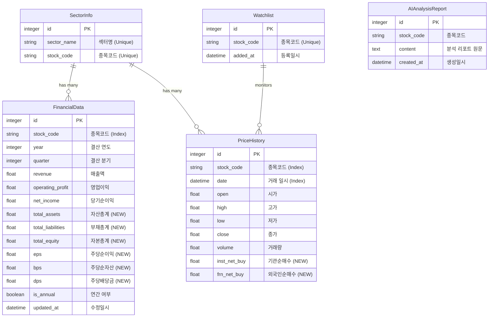

# 프로젝트 안티그래비티: 주식 분석 시스템 기술 보고서 (보고서.md)

본 문서는 프로젝트의 데이터베이스 구조, API 명세 및 주요 구현 로직을 기술적으로 상세히 상술합니다.

---

## 1. 데이터베이스 스키마 (Database Schema)

SQLite를 사용하며, 고성능 시계열 데이터 처리와 효율적인 재무 스크리닝을 위해 설계되었습니다.

### 📊 엔티티 관계도 (ERD)

### 🛠️ 테이블별 상세 명세

#### 1. `financial_data` (재무제표 데이터)
- **용도**: 팩터 스크리닝(Triple Screening) 및 성장성 분석의 원천 데이터.

#### 2. `price_history` (가격 히스토리)
- **용도**: 차트 시각화 및 이동평균선 등 기술적 지표 계산.

#### 3. `sector_info` (업종 분류 정보)
- **용도**: 섹터별 종목 정렬 및 주가 요약 집계.

#### 4. `ai_analysis_reports` (AI 생성 리포트)
- **용도**: GPT-4o 등 LLM이 생성한 최종 분석 요약 저장.

#### 5. `watchlist` (**NEW** 자동 추적 리스트)
- **용도**: 데이터 수집기(`data_collector.py`)가 5분마다 실시간으로 추적할 종목들의 마스터 리스트.
- **특징**: 사용자가 대시보드나 텔레그램으로 조화한 종목은 자동으로 이 테이블에 등록되어 **영구적인 자동 추적 대상**이 됨.

---

## 2. 대화형 명령 및 종목명 매칭 (Interactive Commands)

본 시스템은 사용자가 종목코드를 외우지 않고 **종목명(예: 삼성전자)**으로 분석을 요청할 수 있는 대화형 인터페이스를 지원합니다.

### 🔍 종목명 <-> 코드 변환 (Ticker Mapping)
- **기능**: '삼성전자' -> '005930', 'SK하이닉스' -> '000660' 자동 변환.
- **구현**: 한국 거래소(KRX) 상장 종목 리스트를 기반으로 내부 매핑 엔진 구축.

### 🤖 텔레그램 & 대시보드 통합 명령
- **검색 개정**: '하이닉스'와 같은 부분 종목명으로도 검색 가능하도록 **Fuzzy Search** 엔진 탑재.
- **표기 표준**: 모든 UI(와치리스트, 스크리너, 차트)에서 **종목명(종목코드)** 형식을 병행 표기하여 유저 편의성 극대화.

---

## 3. 데이터 획득 주기 (Data Lifecycle)

| 데이터 종류 | 수집 주기 | 데이터 소스 | 주요 항목 |
| :--- | :--- | :--- | :--- |
| **실시간 시세** | **5분마다** | 한국투자증권(KIS) / Yahoo | 시/고/저/종가, 거래량 |
| **스로틀링** | **KIS API 기준** | **1초에 1회 제한** | 안정성 및 API 정책 준수 |
| **재무제표** | **1일 1회** | DART API | 매출액, 영업이익, 당기순이익 |
| **적용 범위** | **와치리스트 등록 전 종목** | Dynamic | 유저가 추가한 모든 종목 무한 확장 가능 |

---

## 4. 멀티 API 연동 및 데이터 처리 전략 (Multi-Source Strategy)

여러 증권사나 데이터 제공사 API를 동시에 사용할 경우의 중복 및 안정성 문제를 다음과 같이 해결합니다.

### 🛡️ 중복 데이터 방지 (Deduplication)
- **메커니즘**: `PriceHistory`와 `FinancialData` 테이블에 `stock_code` + `date` (또는 `year/quarter`) 조합의 **복합 유니크 인덱스**를 설정합니다.
- **효과**: 서로 다른 API 소스에서 동일한 시점의 주가 데이터가 들어오더라도 DB 수준에서 `Conflict` 발생 시 `Ignore` 또는 `Update(Upsert)` 처리를 통해 단일 진실 공급원(Single Source of Truth)을 유지합니다.

### 🔄 데이터 수집 순환 및 가용성 (Rotation & Failover)
- **순환 호출 (Round-Robin)**: API별 호출 한도(Rate Limit)를 고려하여, 수집 요청 시 사용 가능한 Provider 리스트를 순환하며 호출하는 엔진을 권장합니다.
- **장애 극복 (Failover)**: 주 소스(예: 한국거래소 직접 API) 장애 시 부 소스(예: Yahoo Finance)로 즉시 전환되는 폴백(Fallback) 로직을 통해 수집 중단을 방지합니다.

### ⚖️ 데이터 신뢰도 가중치 (Priority)
- 동일 시점 데이터가 소스별로 상이할 경우, 사전에 정의된 **신뢰도 가중치(Metadata)**에 따라 우선순위가 높은 소스의 데이터를 최종 채택합니다.

---

## 6. 다중 뷰 네비게이션 (Professional SPA) [PHASE 21]

사용자 편의성을 위해 시스템을 단일 페이지에서 사이드바 기반의 전문 SPA 구조로 개편하였습니다.

### 🏛️ 주요 화면 구성
1. **종합 대시보드 (Macro Board)**:
   - KOSPI, KOSDAQ 지수 실시간 추이 및 전일 대비 변동률 제공.
   - 국제 금 시세(Gold), WTI 유가(Oil), 달러 환율(USD/KRW) 통합 모니터링.
2. **종목 분석 (Individual Analysis)**:
   - 특정 기업(예: 삼성전자)의 6개월 주가 트렌드 및 기관/외국인 누적 수급 차트.
   - 다년도/다분기 상세 재무제표(매출, 영익, 자산, EPS 등) 테이블.
3. **관심종목 (Watchlist)** _(2026-03-21 추가)_:
   - DB 와치리스트에 등록된 전체 종목을 카드 그리드로 표시.
   - 종목명 검색으로 신규 종목 즉시 추가 (`POST /api/commands/analyze/{stock_name}` 연동).
   - 각 종목별 분석 탭으로 즉시 이동(👁️) 및 관심종목 제거(🗑️) 기능.
   - **백엔드 신규 API**: `DELETE /api/commands/watchlist/{stock_code}` 추가.
4. **시스템/DB 상태 (Database Status)**:
   - `stock.db` 파일의 물리적 위치(`Applications/stock_dashboard/`) 명시.
   - 현재 적재된 기업 수 및 총 주가 레코드 건수 가시화(Transparency).

### ⚙️ 접속 가이드
- **백엔드**: `http://localhost:8000` (FastAPI)
- **프론트엔드**: `http://localhost:5174` (Vite + React)

---

## 7. 현재 개발 단계 및 향후 계획

- **현재 완료**: 백엔드 엔진, 5174 포트 기반 전문 SPA, 매크로 수집기, **자산/부채/EPS 등 7종 확장 재무 데이터**, **기관/외국인 수급 트렌드**, **KOSPI/지수/원자재 종합 대시보드**.
- **향후 계획**: 실시간 차트 스트리밍 최적화 및 멀티 유저 알림 시스템 확장.

---

## 8. 버그 수정 이력 (Bug Fix Log)

### 2026-03-21 — 5건 수정

| # | 파일 | 수정 내용 | 영향 |
| :--- | :--- | :--- | :--- |
| **BF-01** | `main.py` | `from datetime import datetime` 임포트 추가 | `/api/dashboard/stats` 호출 시 NameError 런타임 오류 해결 |
| **BF-02** | `main.py` | `get_ready_reports()`에서 `stock["code"]` → `stock["stock_code"]` 키 수정 | `/api/reports/ready` 호출 시 KeyError 오류 해결 |
| **BF-03** | `processor.py` | `get_sector_performance()`에 `return performance` 추가 | `/api/dashboard/sectors`가 항상 `null` 반환하던 문제 해결 |
| **BF-04** | `kis_client.py` | 미완성 중복 `get_current_price()` 첫 번째 정의 제거 | KIS 현재가 조회 메서드 중복으로 인한 불안정성 제거 |
| **BF-05** | `kis_client.py` | `get_investor_trends()`에 실제 HTTP 요청 코드 완성 | 기관/외국인 수급 데이터 수집 불가 → 정상 수집 가능 |

